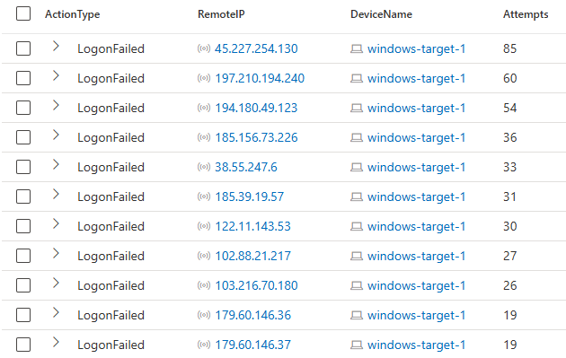
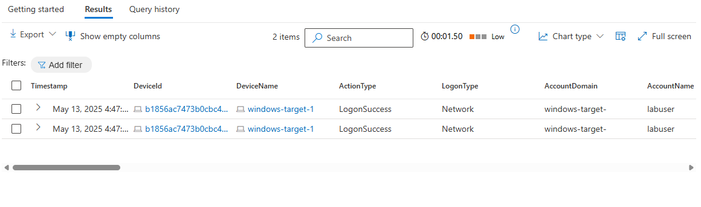
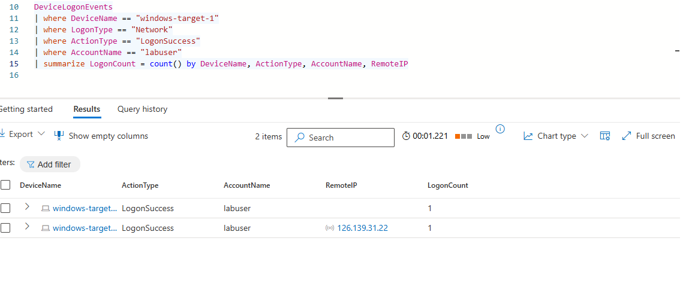

# ⚔️ Threat Hunting Lab: Devices Accidentally Exposed to the Internet

## 🧰 Technologies Used

- 🛡️ **Microsoft Defender for Endpoint** – Provided DeviceInfo and DeviceLogonEvents telemetry  
- 🔎 **Kusto Query Language (KQL)** – Used for querying logon data, failed login attempts, and remote IP sources  
- 🧠 **MITRE ATT&CK Framework** – Mapped observed behavior to known adversary techniques  
- ☁️ **Azure NSG (Network Security Groups)** – Referenced in response recommendations to restrict RDP access

## 🧪 Scenario Summary

During routine maintenance, the security team was tasked with investigating virtual machines (VMs) in the shared services cluster that may have been mistakenly exposed to the public internet. The goal was to identify misconfigured devices and determine if any brute-force login attempts or successes occurred.

---

## 🧭 Lab Setup

- **Target VM**: `windows-target-1`
- **Duration of Exposure**: 7 days
- **Log Sources Used**:
  - `DeviceInfo`
  - `DeviceLogonEvents`
- **Hypothesis**: Publicly exposed VMs without account lockout policies were vulnerable to brute-force login attacks.
- <br>

## ✅ 'IsInternetFacing' Stored KQL function details

When leveraging the `IsInternetFacing` function in Kusto Query Language (KQL), ensure the query includes checks for commonly exposed network services. Enumerate and validate these critical internet-facing services to proactively identify potential security exposures or misconfigurations:

* **DNS (Domain Name System)** – Port 53 TCP/UDP
* **DHCP (Dynamic Host Configuration Protocol)** – Ports 67/68 UDP
* **HTTP (Hypertext Transfer Protocol)** – Port 80 TCP
* **HTTPS (Hypertext Transfer Protocol Secure)** – Port 443 TCP
* **SMTP (Simple Mail Transfer Protocol)** – Port 25 TCP
* **FTP (File Transfer Protocol)** – Ports 20/21 TCP
* **SSH (Secure Shell)** – Port 22 TCP
* **Telnet** – Port 23 TCP
* **RDP (Remote Desktop Protocol)** – Port 3389 TCP
* **LDAP (Lightweight Directory Access Protocol)** – Port 389 TCP
* **LDAPS (LDAP Secure)** – Port 636 TCP
* **IMAP (Internet Message Access Protocol)** – Ports 143 (IMAP) / 993 (IMAPS) TCP
* **POP3 (Post Office Protocol version 3)** – Ports 110 (POP3) / 995 (POP3S) TCP
* **VPN gateways (IKE/IPSec)** – Ports 500/4500 UDP
* **SMB/CIFS (Server Message Block)** – Port 445 TCP
* **Database servers (e.g., MSSQL/MySQL)** – Ports 1433 (MSSQL), 3306 (MySQL) TCP
* **Network Management (SNMP)** – Ports 161/162 UDP
* **Web Proxy servers** – Ports 8080, 3128 TCP

Including these services explicitly within your KQL queries helps in rapidly identifying and securing potential external attack surfaces.

---

## 🔍 Phase 1: Data Collection

Check for internet-facing devices:
```kql
DeviceInfo
| where DeviceName == "windows-target-1"
| where IsInternetFacing == true
| order by Timestamp desc
```

Check logon actions on the target device:
```kql
DeviceLogonEvents
| where DeviceName == "windows-target-1"
| summarize count() by ActionType
| order by count_ desc
```

---

## 📊 Phase 2: Data Analysis

Identify failed logon attempts from remote IPs:
```kql
DeviceLogonEvents
| where DeviceName == "windows-target-1"
| where LogonType has_any("Network", "Interactive", "RemoteInteractive", "Unlock")
| where ActionType == "LogonFailed"
| where isnotempty(RemoteIP)
| summarize Attempts = count() by RemoteIP, DeviceName
| order by Attempts desc
```
## 🔐 Top Failed Logon Attempts




Check if any of the top offending IPs succeeded:
```kql
let RemoteIPsInQuestion = dynamic(["45.227.254.130","197.210.194.240", "194.180.49.123", "185.156.73.226", "38.55.247.6", "185.39.19.57", "122.11.143.53"]);
DeviceLogonEvents
| where LogonType has_any("Network", "Interactive", "RemoteInteractive", "Unlock")
| where ActionType == "LogonSuccess"
| where RemoteIP has_any(RemoteIPsInQuestion)
```

## ✅ No results were returned, indicating NO successful logons from these IPs.

Check for Any Successful Logons 
```kql
DeviceLogonEvents
| where DeviceName == "windows-target-1"
| where LogonType has_any("Network", "Interactive", "RemoteInteractive", "Unlock")
| where ActionType == "LogonSuccess"
| order by Timestamp desc
```

## ✅ Verified Only 2 Successful Logins During 7 Day Internet Exposure

Check Valid Logons by Known Account:
```kql
DeviceLogonEvents
| where DeviceName == "windows-target-1"
| where LogonType == "Network"
| where ActionType == "LogonSuccess"
//| where AccountName == "labuser" //add this after in second running of this query
```
## ✅ Successful Logons by Account



- Both successful logon events were from same authorized user
- Account: `labuser`
- Number of failed logons: 0
- IP address origin was verified and authorized

## 🌐 Successful IP Address Origin



## ✅ The IP address correlated with an authorized user account and confirmed as the source of both valid logon events.
---

## 🧠 MITRE ATT&CK TTP Mapping

| ID          | Technique                                 |
|-------------|--------------------------------------------|
| T1595.001   | Active Scanning: Scanning IP Blocks       |
| T1110.001   | Brute Force: Password Guessing            |
| T1078       | Valid Accounts                            |

---

## 🧯 Response Actions

- Restrict RDP traffic using NSG rules to trusted IPs only
- Implement account lockout policies
- Enforce multi-factor authentication (MFA)

---

## 📝 Conclusion

Although `windows-target-1` was internet-facing for at least 7 days and received numerous brute-force login attempts, no evidence of unauthorized access was found. All successful logons were tied to a known account (`labuser`) from an authorized location.

---

## 🔄 Lessons Learned

- Restrict access to public services whenever possible
- Monitor remote logon events for patterns of brute-force attempts
- Implement and regularly review MFA and account lockout policies
