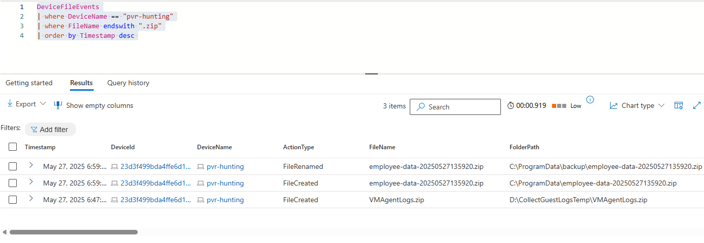
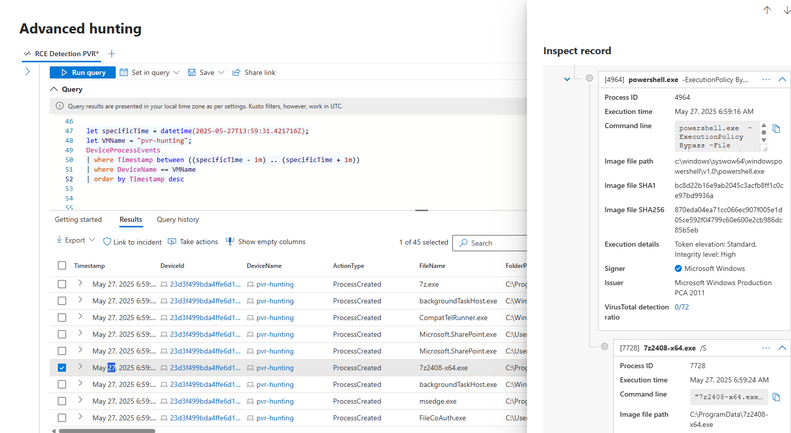
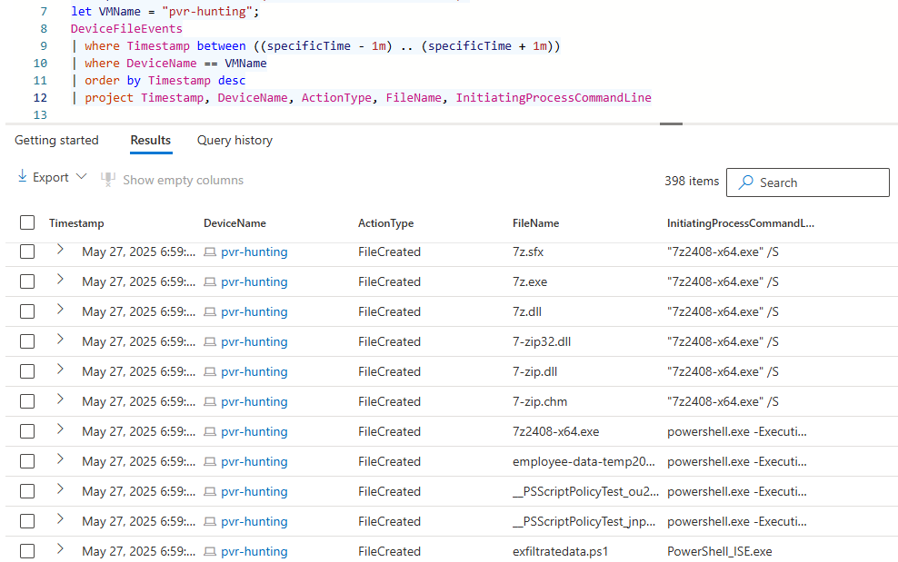
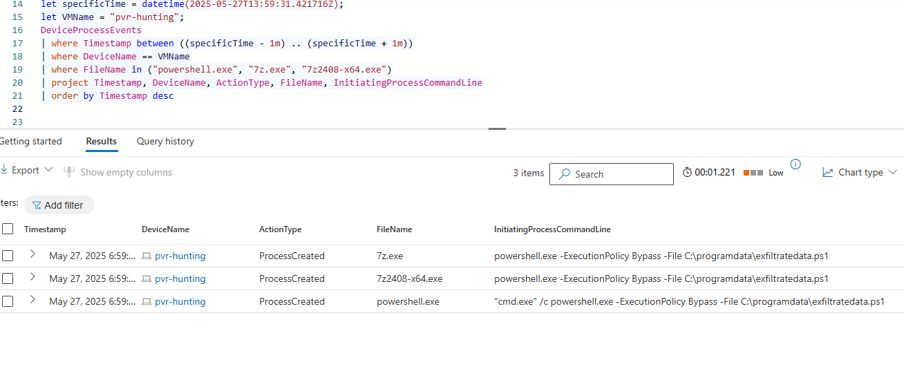
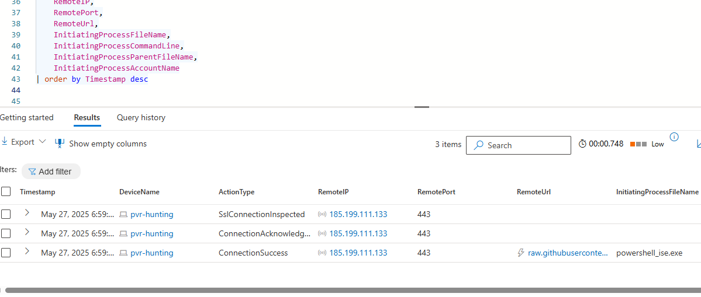

# 🔍 Threat Hunting Lab: Suspicious Insider Exfiltration Attempt

## 🧭 Investigation Scenario
**Context:** An employee named *John Doe*, recently placed on a performance improvement plan (PIP), displayed hostile behavior. Management suspects John may attempt to steal proprietary company data. As a security analyst, your goal is to investigate John’s actions on his assigned device (`pvr-hunting`) using Microsoft Defender for Endpoint (MDE).

### 🎯 Hypothesis
Given John’s elevated privileges, he may:
- Compress sensitive data
- Exfiltrate it to a cloud drive or external destination

---

## 📊 Step 1: File Archiving Detection
This step identifies the creation of ZIP files on the target system, focusing on filenames that suggest potential staging of sensitive data. By querying DeviceFileEvents and filtering by .zip extensions, we begin to establish a baseline of archiving activity and flag any anomalies for further investigation:

```kql
DeviceFileEvents
| where DeviceName == "pvr-hunting"
| where FileName endswith ".zip"
| order by Timestamp desc 
```



I found a ZIP archive that was created with a name matching a sensitive dataset: `employee-data-temp20250527135920.csv`. This initial finding confirms that file archiving activity occurred and helps anchor our timeline for deeper investigation into related processes and network behavior.

---

## 🧮 Step 2: Process Timeline Correlation
Using the ZIP file's creation time (`2025-05-27T13:59:31Z`), searched for correlated processes:

```kql
let specificTime = datetime(2025-05-27T13:59:31.421716Z);
let VMName = "pvr-hunting";
DeviceProcessEvents
| where Timestamp between ((specificTime - 1m) .. (specificTime + 1m))
| where DeviceName == VMName
| order by Timestamp desc
```



This query establishes the timeline of processes running on the endpoint around the time of the suspicious ZIP archive creation. By narrowing the window to one minute before and after the archive event, we begin to reveal a chain of activity. This step is critical to correlating user actions with file manipulation and prepares the foundation for identifying potential exfiltration behavior.

```kql
let specificTime = datetime(2025-05-27T13:59:31.421716Z);
let VMName = "pvr-hunting";
DeviceFileEvents
| where Timestamp between ((specificTime - 1m) .. (specificTime + 1m))
| where DeviceName == "pvr-hunting"
| order by Timestamp desc
| project Timestamp, DeviceName, ActionType, FileName, InitiatingProcessCommandLine
```


Discovered silent installation of 7-Zip (`7z2408-x64.exe`) followed by compression via `7z.exe`. The process timeline provides critical insight into how the attacker leveraged PowerShell to silently install 7-Zip and initiate data staging. This supports the hypothesis of intentional preparation for exfiltration.

---

## 🎯 Step 3: Filtered Relevant Process Events
After identifying the ZIP creation and surrounding activity, this step narrows the focus to three specific processes likely involved in staging or facilitating exfiltration. By isolating powershell.exe, 7z2408-x64.exe, and 7z.exe, we expose the tools used to script, install, and compress data — helping us validate the attacker’s method and intent:

```kql
DeviceProcessEvents
| where Timestamp between ((specificTime - 1m) .. (specificTime + 1m))
| where DeviceName == VMName
| where FileName in ("powershell.exe", "7z.exe", "7z2408-x64.exe")
| project Timestamp, DeviceName, ActionType, FileName, InitiatingProcessCommandLine
| order by Timestamp desc
```



These process details validate that scripting and compression utilities were executed in close sequence, pointing to a coordinated attempt to extract and package data.

---

## 🌐 Step 4: Suspicious Network Connection
To assess potential exfiltration, this step investigates outbound network activity originating from the same system and timeframe. The presence of an HTTPS connection to raw.githubusercontent.com — a domain commonly used for script delivery and covert data transfer — provides a strong indication of command-and-control communication or data exfiltration using web protocols:

```kql
DeviceNetworkEvents
| where Timestamp between ((specificTime - 2m) .. (specificTime + 2m))
| where DeviceName == "pvr-hunting"
| where RemoteIP == "185.199.111.133"
| project Timestamp, DeviceName, ActionType, RemoteIP, RemotePort, RemoteUrl, InitiatingProcessFileName, InitiatingProcessCommandLine, InitiatingProcessParentFileName, InitiatingProcessAccountName
| order by Timestamp desc
```



The outbound HTTPS connection to GitHub’s raw content delivery domain strongly suggests a channel was established for data exfiltration or remote command retrieval.

---

## 🧠 MITRE ATT&CK Mappings

| Technique ID | Technique Name | Explanation |
|--------------|----------------|-------------|
| **T1560.001** | Archive Collected Data: Archive via Utility | `7z.exe` used to compress sensitive data, preparing it for exfiltration. |
| **T1048** | Exfiltration Over Alternative Protocol | Evidence suggests potential use of HTTPS to GitHub for data transfer. |
| **T1059.001** | Command and Scripting Interpreter: PowerShell | PowerShell with `-ExecutionPolicy Bypass` used for automation and execution of exfiltration scripts. |
| **T1071.001** | Application Layer Protocol: Web Protocols | PowerShell communicating over HTTPS to `raw.githubusercontent.com`. |
| **T1070.004** | Indicator Removal on Host: File Deletion | Although not explicitly shown, attackers often delete staging files after exfil — worth deeper inspection. |
| **T1027** | Obfuscated Files or Information | Use of compressed `.zip` files to conceal contents during transfer. |
| **T1105** | Ingress Tool Transfer | Silent install of `7z2408-x64.exe`, likely downloaded from a public source. |

---

## ✅ Summary of Findings
- 📦 Confirmed creation of an archive containing sensitive employee data.
- 💻 Correlated PowerShell script installation and use of `7z.exe`.
- 🌍 Verified outbound connection to GitHub's CDN within minutes of archiving.
- 🧾 Commands and behavior align with known MITRE ATT&CK techniques.

## 🔧 Recommendations
- Immediately isolate the system.
- Consider implementing alerts for excessive .zip activity.
- Escalate the incident to the Incident Response (IR) team.
- Preserve evidence: scripts, command lines, ZIP files, and timelines.
- Audit similar behavior across other endpoints.

---

## 🔁 Process Improvements
- 🚫 Block unauthorized scripting and compression utilities.
- 🕵️‍♂️ Enable alerting on archive creation + outbound HTTPS events to unknown IPs.
- 📉 Limit user permissions on sensitive systems.
- 🔄 Incorporate this hunting pattern into automated detection rules.

---

> 👤 **Analyst Note:**  
> This lab demonstrated how file creation, process command lines, and network telemetry can be correlated to detect and confirm malicious insider activity.
