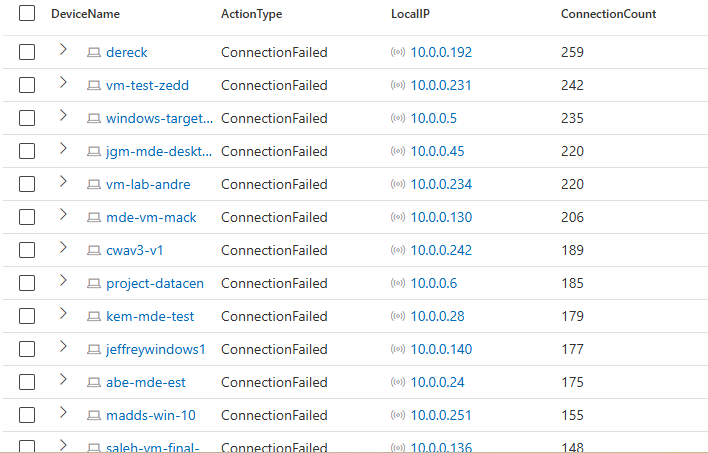
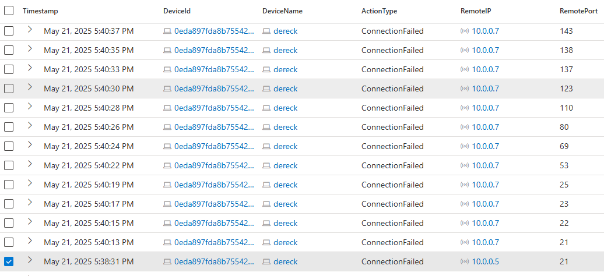
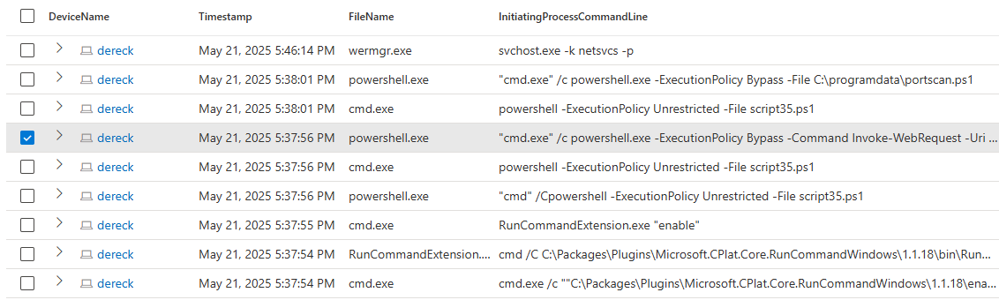
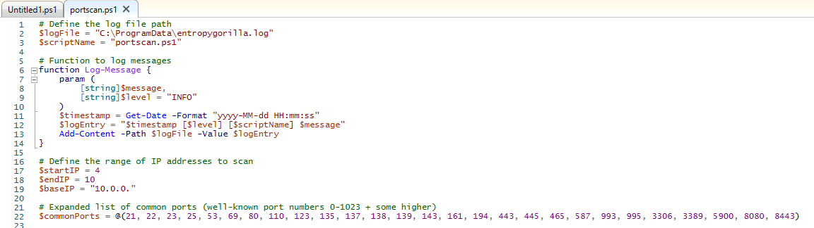

# 🕵️‍♂️ Internal PowerShell Port Scanning Activity

## 🧰 Technologies Used

- 🛡️ **Microsoft Defender for Endpoint** – Provided DeviceNetworkEvents and DeviceProcessEvents telemetry  
- 🔎 **Kusto Query Language (KQL)** – Queried logs for failed connections and suspicious activity  
- 🧠 **MITRE ATT&CK Framework** – Mapped observed techniques to known TTPs for threat classification  
- 🖥️ **Windows 10 VM** – Simulated attacker environment for reconnaissance and discovery activity

## 1 – Preparation

**Goal:** Set up the hunt by defining what you're looking for.

The server team has noticed a significant network performance degradation on some of their older devices attached to the network in the `10.0.0.0/16` network. After ruling out external DDoS attacks, the security team suspects something might be going on internally.

> **Hypothesis:** All traffic originating from within the local network is by default allowed by all hosts. There is also unrestricted use of PowerShell and other applications in the environment. It’s possible someone is either downloading large files or doing some kind of port scanning against hosts in the local network.

---

## 2 – Data Collection

**Goal:** Gather relevant data from logs, network traffic, and endpoints.

### ✅ Log Source Validation

Ensure the relevant tables contain recent logs:

```kql
DeviceNetworkEvents
| order by Timestamp desc 
| take 100

DeviceFileEvents
| order by Timestamp desc 
| take 100

DeviceProcessEvents
| order by Timestamp desc 
| take 100
```

> All key sources are producing log events.

---

### 🔍 Search for Failed Connections

```kql
DeviceNetworkEvents
| where ActionType == "ConnectionFailed"
| summarize ConnectionCount = count() by DeviceName, ActionType, LocalIP
| order by ConnectionCount
```

> Multiple devices were found failing connections.



---

## 3 – Data Analysis

Device `dereck` had the most failed connection requests, showing sequential port scan behavior.

```kql
let IPInQuestion = "10.0.0.192";
DeviceNetworkEvents
| where ActionType == "ConnectionFailed"
| where LocalIP == IPInQuestion
| order by Timestamp desc
```



---

## 4 – Investigation

I pivoted to the DeviceProcessEvents table to see if I could see anything suspicious around the time the port scan started. I noticed an obvioius PowerShell script `portscan.ps1` executing at the time of the scan:

```kql
let VMName = "dereck";
let specificTime = datetime(2025-05-22T00:38:31.0946361Z);
DeviceProcessEvents
| where Timestamp between ((specificTime - 10m) .. (specificTime + 10m))
| where DeviceName == VMName
| order by Timestamp desc
| project DeviceName, Timestamp, FileName, InitiatingProcessCommandLine
```



---


### 🔐 Executed by SYSTEM Account
When the device was correated to the user's AccountName, it was found that the portscan script was launched by the System account - not expected behavior or an activity originating from system administrators.  


```kql
let VMName = "dereck";
let specificTime = datetime(2025-05-22T00:38:31.0946361Z);
DeviceProcessEvents
| where Timestamp between ((specificTime - 10m) .. (specificTime + 10m))
| where DeviceName == VMName
| where InitiatingProcessCommandLine contains "portscan"
| order by Timestamp desc
| project DeviceName, Timestamp, FileName, InitiatingProcessCommandLine, AccountName
```

### 📄 Script Observed on Host




---

### 🧼 Containment Status

As such, the device was isolated and scanned in Defender for Endpoint. No malware was detected, but the system was quarantined and a ticket was created for system reimaging.

---

## 🧭 MITRE ATT&CK Framework Related TTPs

```
TA0043 – Reconnaissance  
• T1595 – Active Scanning  
  > Host `dereck` conducted sequential failed connection attempts (internal port scan).

TA0002 – Execution  
• T1059.001 – PowerShell  
  > Unapproved script `portscan.ps1` executed via PowerShell.

TA0004 – Privilege Escalation  
• T1078 – Valid Accounts  
  > SYSTEM account used for execution, likely misused or manipulated.

TA0007 – Discovery  
• T1046 – Network Service Discovery  
  > PowerShell script used to discover services across the subnet.

TA0008 – Lateral Movement *(Possible Future Step)*  
• T1021 – Remote Services *(Hypothetical)*  
  > Port scanning often precedes attempts to access remote services.
```

---

## 🛡️ Remediation

1. **Isolate Affected Host (`dereck`)**  
   ✅ Already completed. Prevents further threat propagation.

2. **Reimage the Compromised System**  
   ✅ Already completed. SYSTEM-level execution requires a clean rebuild, not just malware cleanup.

3. **Conduct an Environment-Wide Threat Hunt**  
   Hunt for similar behaviors: PowerShell misuse, SYSTEM process execution, and port scanning activity.

4. **User & Admin Awareness Training**  
   Promote awareness of PowerShell risks and proper security hygiene.
