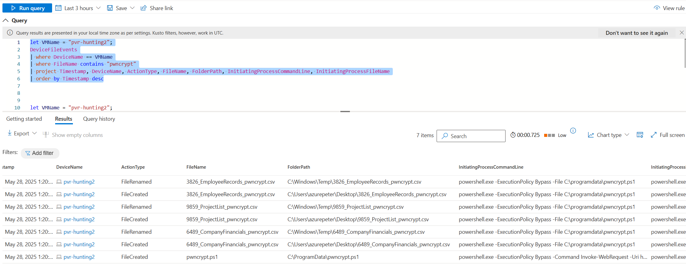
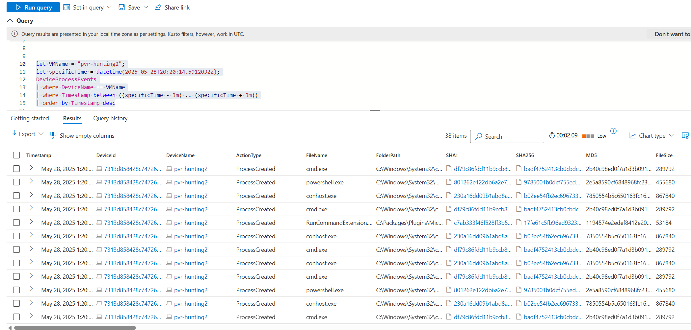
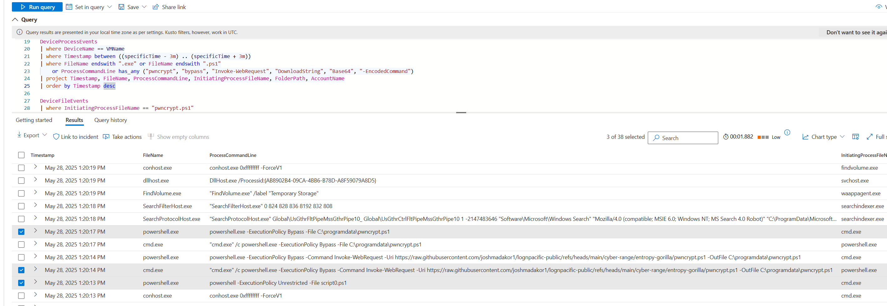
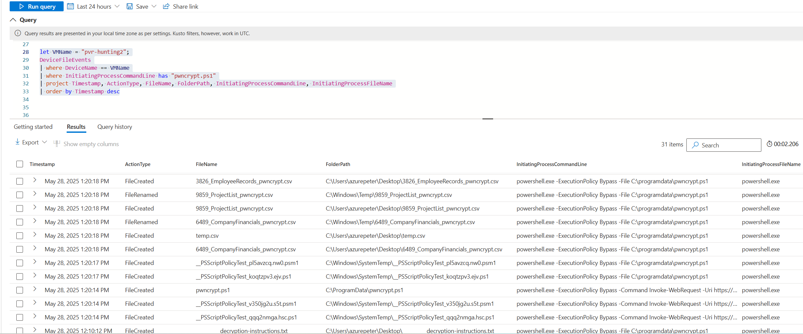
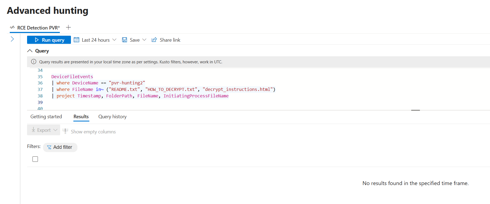

# 🕵️‍♂️ Zero-Day Ransomware (PwnCrypt) Outbreak

## 🧪 Investigation Scenario

### 🔐 Goal:
I was tasked to investigate a newly discovered ransomware strain known as **PwnCrypt**. This strain uses a PowerShell-based payload to encrypt files on infected systems, prepending `.pwncrypt` to the original file extensions. For example, `hello.txt` becomes `hello.pwncrypt.txt`.

The CISO has raised concerns about potential lateral spread due to immature defenses and a lack of security awareness training. My task was to determine whether the ransomware has affected any systems, how it was delivered, and whether it established persistence.

---

## 🔬 Step 1: Define Scope and Threat Hypothesis

To begin the hunt, I developed hypotheses grounded in initial threat intelligence. PwnCrypt is known to use PowerShell droppers and encode payloads, often delivered via GitHub links or base64 strings. It leaves behind encrypted files containing `.pwncrypt` and a ransom note labeled something like `decryption-instructions`.

- **Expected behavior:**
  - Execution of PowerShell with flags like `-ExecutionPolicy Bypass`
  - Use of `Invoke-WebRequest` or `DownloadString`
  - Creation of `.pwncrypt` file artifacts
  - Possible ransom note dropped post-encryption

---

## 📥 Step 2: Confirm Table Coverage

Before diving into IoC searches, I confirmed that both `DeviceProcessEvents` and `DeviceFileEvents` had coverage for the affected systems during the target timeframe. This ensured I’d be able to trace both process execution and file impact.

---

## 📁 Step 3: Identify File-Based IoCs in DeviceFileEvents

```kql
let VMName = "pvr-hunting2";
DeviceFileEvents
| where DeviceName == VMName
| where FileName contains "pwncrypt"
| project Timestamp, DeviceName, ActionType, FileName, FolderPath, InitiatingProcessCommandLine, InitiatingProcessFileName
| order by Timestamp desc
```

This query scans for any files with names containing “pwncrypt” on the target VM. It’s designed to catch encrypted documents, payload scripts (e.g., `pwncrypt.ps1`), and ransom notes.



✅ **Outcome:** Multiple encrypted files with `.pwncrypt` in the name were discovered, along with signs of the script that initiated them — confirming local impact.

---

## 📆 Step 4: Timeline Reconstruction Around Known Execution

```kql
let VMName = "windows-target-1";
let specificTime = datetime(2024-10-16T05:24:46.8334943Z);
DeviceProcessEvents
| where DeviceName == VMName
| where Timestamp between ((specificTime - 3m) .. (specificTime + 3m))
| order by Timestamp desc
```

Using a confirmed execution timestamp, I zoomed out to view all surrounding process activity within a ±3-minute window. This helped map the full chain of events and surfaced the parent process (`cmd.exe`) that launched PowerShell.



Establishing a timeline relationship revealed the entry vector and highlighted early-stage behavior.

---

## 🧹 Step 5: Focused Process Filtering Around Payload Execution

```kql
let VMName = "pvr-hunting2";
let specificTime = datetime(2025-05-28T20:20:14.5912032Z);
DeviceProcessEvents
| where DeviceName == VMName
| where Timestamp between ((specificTime - 3m) .. (specificTime + 3m))
| where FileName endswith ".exe" or FileName endswith ".ps1"
    or ProcessCommandLine has_any ("pwncrypt", "bypass", "Invoke-WebRequest", "DownloadString", "Base64", "-EncodedCommand")
| project Timestamp, FileName, ProcessCommandLine, InitiatingProcessFileName, FolderPath, AccountName
| order by Timestamp desc
```

To isolate only the relevant activity, I filtered down to suspicious executables, PowerShell scripts, and key strings associated with script execution or encoding. This sharpened the view of malicious tooling.



✅ **Outcome:** I exposed a clear execution chain:
- `cmd.exe` spawns `powershell.exe`
- PowerShell downloads `pwncrypt.ps1`
- The script runs with execution policy bypassed

---

## 🔗 Step 6: Reconstruct the Execution Chain

### 🧩 Key Malicious Sequence

| Time (UTC)  | Process Chain            | Command Summary                                              |
|-------------|---------------------------|--------------------------------------------------------------|
| 13:20:14    | `cmd.exe` → `powershell.exe` | `Invoke-WebRequest` downloads `pwncrypt.ps1` from GitHub     |
| 13:20:17    | `powershell.exe`         | `-ExecutionPolicy Bypass -File C:\programdata\pwncrypt.ps1` |

This sequence confirms intentional delivery and execution of the ransomware using living-off-the-land binaries (LOLBins). The use of `Invoke-WebRequest` and PowerShell in this manner is a red flag in most environments.

---

## 🚨 Step 7: Prioritize Key Events for Incident Response

| Time       | Process           | Detail                                                 | Meaning                                |
|------------|-------------------|---------------------------------------------------------|----------------------------------------|
| 13:20:14   | powershell.exe     | `Invoke-WebRequest -Uri https://...pwncrypt.ps1`        | 🚨 Downloader invoked                   |
| 13:20:17   | powershell.exe     | `-ExecutionPolicy Bypass -File pwncrypt.ps1`            | 🚨 Payload executed                     |
| 13:20:13   | powershell.exe     | `-ExecutionPolicy Unrestricted -File script0.ps1`       | ⚠️ Possibly earlier test/staging        |

🧠 **Insight:** These three command lines represent the critical chain of infection — from download to encryption. They also serve as detection opportunities.

---

## 📂 Step 8: Trace File Impact from pwncrypt.ps1

```kql
let VMName = "pvr-hunting2";
DeviceFileEvents
| where DeviceName == VMName
| where InitiatingProcessCommandLine has "pwncrypt.ps1"
| project Timestamp, ActionType, FileName, FolderPath, InitiatingProcessCommandLine, InitiatingProcessFileName
| order by Timestamp desc
```

This query links all file modifications back to the ransomware script. By keying in on `InitiatingProcessCommandLine`, I tracked the spread and encryption events triggered by `pwncrypt.ps1`.



✅ **Outcome:** I confirmed file encryption shortly after execution, including sensitive files on the user’s desktop — a common target for ransomware.

---

## 🗂️ Step 9: Ransomware Execution Timeline Summary

**Host:** `pvr-hunting2`

- 🕒 **13:20:14 UTC** – `powershell.exe` downloads `pwncrypt.ps1`
- 🕒 **13:20:17 UTC** – Script executed via `-ExecutionPolicy Bypass`
- 🕒 **13:20:30+ UTC** – Files encrypted with `.pwncrypt` extension
- 📂 **Files Affected:**
  - `3698_EmployeeRecords_pwncrypt.csv`
  - `8955_CompanyFinancials_pwncrypt.csv`
  - `9543_ProjectList_pwncrypt.csv`
  - `________decryption-instructions` (ransom note)

🧠 **Observation:** Ransomware focused on business-sensitive files and dropped an easily identifiable ransom note to the desktop.

---

## 🔍 Step 10: Search for Ransom Note Creation

```kql
DeviceFileEvents
| where DeviceName == "pvr-hunting2"
| where FileName has "decrypt" or FileName contains "instruction"
| project Timestamp, FolderPath, FileName, InitiatingProcessFileName
```

This final check scans for files resembling ransom notes. These are typically dropped by ransomware after file encryption and often named `readme.txt`, `instructions.html`, or similar.



✅ **Confirmed:** `________decryption-instructions` was dropped alongside encrypted files — validating the ransomware’s impact and helping complete the forensic narrative.

---

## 🎯 MITRE ATT&CK Technique Mapping

| Technique | ID | Description |
|----------|----|-------------|
| **Command and Scripting Interpreter: PowerShell** | [T1059.001](https://attack.mitre.org/techniques/T1059/001/) | Malicious PowerShell used for execution and scripting. |
| **Ingress Tool Transfer** | [T1105](https://attack.mitre.org/techniques/T1105/) | Remote script downloaded from GitHub via `Invoke-WebRequest`. |
| **User Execution** | [T1204](https://attack.mitre.org/techniques/T1204/) | Likely user-initiated from `cmd.exe`, possibly via phishing or social engineering. |
| **Data Encrypted for Impact** | [T1486](https://attack.mitre.org/techniques/T1486/) | File encryption confirmed via file extensions and dropped ransom note. |
| **Masquerading** | [T1036](https://attack.mitre.org/techniques/T1036/) | Script placed in `ProgramData` to appear benign or admin-like. |
| **Execution Guardrails** | [T1480.001](https://attack.mitre.org/techniques/T1480/001/) | Use of `-ExecutionPolicy Bypass` to circumvent PowerShell protections. |

---

## 📌 Conclusion

### ✅ Findings:
- Ransomware downloaded and executed via PowerShell
- Business-critical files encrypted with `.pwncrypt` extension
- Ransom note dropped to Desktop
- No persistence or lateral movement detected during this hunt

---

## 🛡️ Step 11: Incident Response Recommendations

- 🔒 Isolate infected endpoint from the network
- 📤 Export all process and file event logs around infection timestamp
- 🧼 Remove `pwncrypt.ps1` and encrypted files, begin restoration from backup
- 💬 Notify stakeholders and legal if necessary

---

## 🔁 Step 12: Future Prevention

- 🚧 Enforce PowerShell Constrained Language Mode for non-admin users
- 📊 Ensure Defender for Endpoint logging is fully enabled and retained
- 🧑‍🏫 Train employees on phishing recognition and suspicious activity reporting
- 🔐 Use AppLocker or WDAC to block unauthorized scripts
- 🛎️ Create alerting rules for PowerShell + download + bypass patterns

---

> 🧠 **Reflection:** This hunt demonstrates the importance of tying together file and process telemetry to reconstruct attack timelines. Even without behavioral alerts, attacker intent becomes clear when we follow the data breadcrumbs.
````
