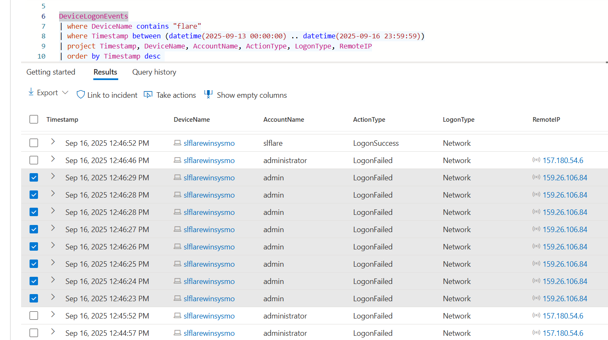
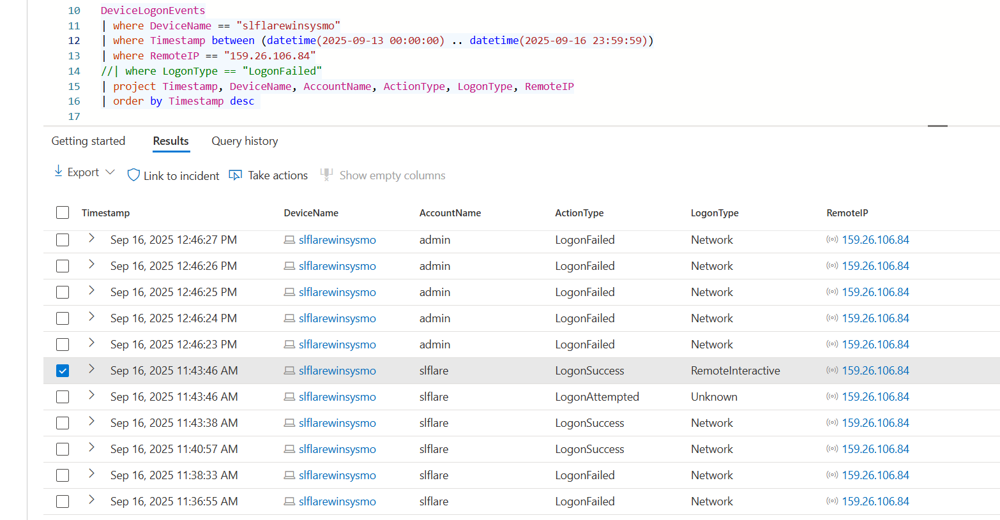
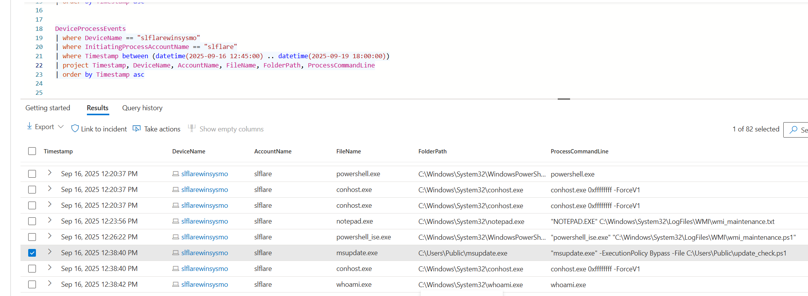
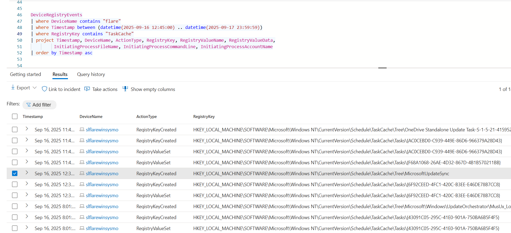
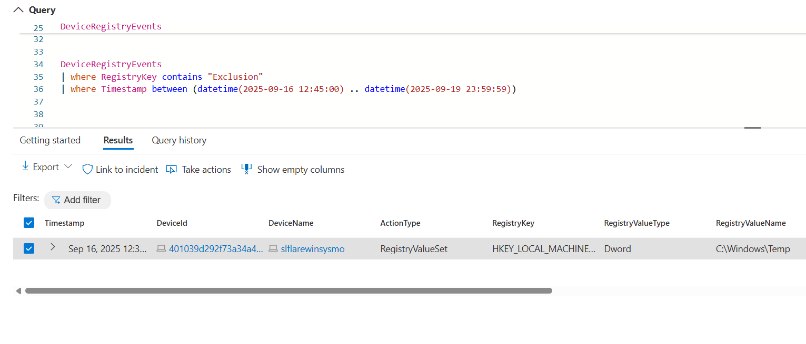
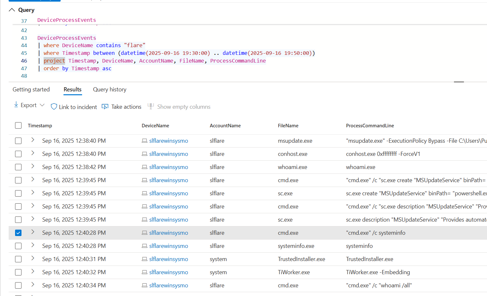
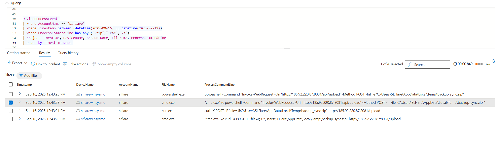
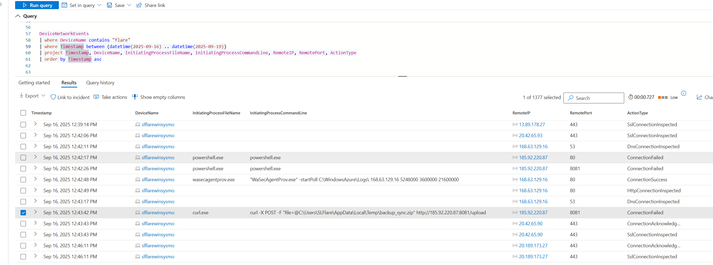
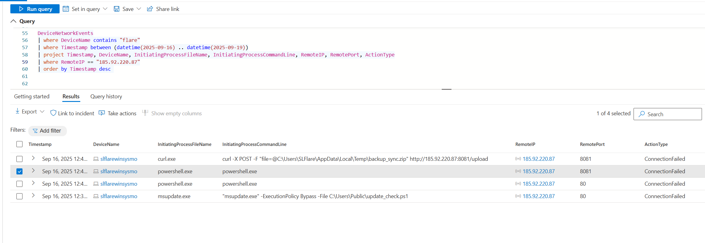

# 🕵️‍♂️ Threat Hunt Report: **Hide Your RDP – Password Spray Leads to Full Compromise**

**Analyst:** Peter Van Rossum  
**Date Completed:** 21-September-2025  
**Environment Investigated:** An Azure-based enterprise cloud environment representing a modern corporate network with roughly 1,000 licensed endpoints under centralized security management. The environment integrates Microsoft Defender for Endpoint (MDE) for host-level telemetry and protection, and Microsoft Sentinel as the SIEM/SOAR platform for log aggregation, correlation, and incident response. 
**Timeframe:** September 16, 2025 – 11:43:46 to 12:43:42 (UTC)  
**Duration:** 59 minutes, 56 seconds  

---

## 🧠 Scenario Overview
Suspicious RDP activity against a cloud-hosted Windows system escalated into full compromise. The attacker brute-forced valid credentials, executed a malicious binary, established persistence, impaired defenses, ran discovery commands, archived sensitive data, and attempted exfiltration to an external server. This hunt reconstructs the timeline, identifies the attacker’s techniques, and correlates Sysmon, Defender, and Sentinel telemetry to flag key adversary actions.

---

## 🎯 Executive Summary
The adversary gained access via brute-forced RDP credentials (`slflare`), executed `msupdate.exe`, and persisted with a scheduled task (`MicrosoftUpdateSync`). They disabled Windows Defender scanning, ran reconnaissance (`systeminfo`), staged sensitive data into `backup_sync.zip`, and attempted to exfiltrate it via `curl` to `185.92.220.87:8081`. Multiple outbound connections (PowerShell, msupdate.exe, curl) to `185.92.220.87` indicate C2 activity. The attacker’s intent was **data theft**, with exfiltration staged from the SLFlare user profile.

---

## ✅ Completed Flags

| Flag # | Objective | Value |
|--------|-----------|-------|
| **1** | Attacker IP Address | `159.26.106.84` |
| **2** | Compromised Account | `slflare` |
| **3** | Executed Binary | `msupdate.exe` |
| **4** | Command Line Used | `"msupdate.exe" -ExecutionPolicy Bypass -File C:\Users\Public\update_check.ps1` |
| **5** | Scheduled Task Created | `MicrosoftUpdateSync` |
| **6** | Defender Exclusion Path | `C:\Windows\Temp` |
| **7** | Discovery Command | `"cmd.exe" /c systeminfo` |
| **8** | Archive File Created | `backup_sync.zip` |
| **9** | C2 Destination | `185.92.220.87` |
| **10** | Exfiltration Attempt | `185.92.220.87:8081` |

---

## Flag by Flag

### 🚩 Flag 1 – Attacker IP Address
**MITRE Technique:** T1110.001 – Brute Force: Password Guessing  

The query inspects RDP logon events on the flare host to identify the external IP that successfully brute-forced access. This isolates the attacker’s source infrastructure.

**Finding:** Successful RDP login from external IP `159.26.106.84` after repeated failures.  
**KQL Query Used:**
````kql
DeviceLogonEvents
| where DeviceName contains "flare"
| where Timestamp between (datetime(2025-09-14 00:00:00) .. datetime(2025-09-14 23:59:59))

DeviceLogonEvents
| where DeviceName == "slflarewinsysmo"
| where Timestamp between (datetime(2025-09-13 00:00:00) .. datetime(2025-09-16 23:59:59))
| where RemoteIP == "159.26.106.84"
| project Timestamp, DeviceName, AccountName, ActionType, LogonType, RemoteIP
| order by Timestamp desc
````



---

### 🚩 Flag 2 – Compromised Account
**MITRE Technique:** T1078 – Valid Accounts  

The same logon data shows which valid account was used in the successful login. This confirms the adversary leveraged slflare credentials to gain access.

**Finding:** The attacker successfully authenticated using the account `slflare`.  
**KQL Query Used:** (same as Flag 1)  



---

### 🚩 Flag 3 – Executed Binary
**MITRE Techniques:** T1059.003 – Windows Command Shell, T1204.002 – User Execution  

Process creation events are queried to uncover suspicious executables launched by the compromised user. This exposes msupdate.exe as the attacker’s payload.

**Finding:** The attacker executed a suspicious binary `msupdate.exe`.  
**KQL Query Used:**
````kql
DeviceProcessEvents
| where DeviceName == "slflarewinsysmo"
| where InitiatingProcessAccountName == "slflare"
| where Timestamp between (datetime(2025-09-16 12:45:00) .. datetime(2025-09-19 18:00:00))
| project Timestamp, DeviceName, AccountName, FileName, FolderPath, ProcessCommandLine
| order by Timestamp asc
````



---

### 🚩 Flag 4 – Command Line Used
**MITRE Technique:** T1059 – Command and Scripting Interpreter  

The query extracts the full command line parameters tied to the malicious binary execution. This reveals the attacker’s intent to bypass execution policy and run a PowerShell script.

**Finding:** `"msupdate.exe" -ExecutionPolicy Bypass -File C:\Users\Public\update_check.ps1`  
**KQL Query Used:** (derived from Flag 3 results)  

---

### 🚩 Flag 5 – Scheduled Task Created
**MITRE Technique:** T1053.005 – Scheduled Task  

Registry event data is searched for TaskCache entries to detect persistence mechanisms. This highlights the attacker’s creation of the MicrosoftUpdateSync scheduled task.

**Finding:** Scheduled Task `MicrosoftUpdateSync` was created for persistence.  
**KQL Query Used:**
````kql
DeviceRegistryEvents
| where DeviceName contains "flare"
| where Timestamp between (datetime(2025-09-16 12:45:00) .. datetime(2025-09-17 23:59:59))
| where RegistryKey contains "TaskCache"
| project Timestamp, DeviceName, ActionType, RegistryKey, RegistryValueName, RegistryValueData, InitiatingProcessFileName, InitiatingProcessCommandLine, InitiatingProcessAccountName
| order by Timestamp asc
````


---

### 🚩 Flag 6 – Defender Exclusion Path
**MITRE Technique:** T1562.001 – Impair Defenses: Disable or Modify Tools  

Registry modifications are reviewed to detect Defender configuration changes. This shows the adversary weakening defenses by excluding C:\Windows\Temp from scanning.

**Finding:** Defender exclusion added for path `C:\Windows\Temp`.  
**KQL Query Used:**
````kql
DeviceRegistryEvents
| where RegistryKey contains "Microsoft\Windows Defender\Exclusions\Paths"
| project Timestamp, DeviceName, RegistryKey, RegistryValueData
````


---

### 🚩 Flag 7 – Discovery Command
**MITRE Technique:** T1082 – System Information Discovery  

Process events are filtered for cmd.exe with the systeminfo argument. This identifies the attacker’s reconnaissance activity to learn system details.

**Finding:** Attacker ran discovery using `cmd.exe /c systeminfo`.  
**KQL Query Used:**
````kql
DeviceProcessEvents
| where FileName == "cmd.exe"
| where ProcessCommandLine contains "systeminfo"
| project Timestamp, DeviceName, AccountName, ProcessCommandLine
````



---

### 🚩 Flag 8 – Archive File Created
**MITRE Technique:** T1074.001 – Data Staged: Local Data Staging  

File creation logs are queried to spot sensitive data being staged. This captures the creation of backup_sync.zip as a precursor to exfiltration.

**Finding:** Sensitive data staged into `backup_sync.zip` in AppData Temp directory.  
**KQL Query Used:**
````kql
DeviceFileEvents
| where FileName == "backup_sync.zip"
| project Timestamp, DeviceName, FolderPath, FileName, ActionType
````



---

### 🚩 Flag 9 – C2 Destination
**MITRE Technique:** T1071.001 – Application Layer Protocol: Web Protocols  

Network events are inspected for outbound connections to known malicious IPs. This confirms contact with external C2 infrastructure at 185.92.220.87.

**Finding:** Outbound traffic to `185.92.220.87` observed from compromised host.  
**KQL Query Used:**
````kql
DeviceNetworkEvents
| where DeviceName contains "flare"
| where RemoteIP == "185.92.220.87"
| project Timestamp, DeviceName, InitiatingProcessFileName, InitiatingProcessCommandLine, RemoteIP
| order by Timestamp desc
````



---

### 🚩 Flag 10 – Exfiltration Attempt
**MITRE Technique:** T1048.003 – Exfiltration Over Unencrypted Protocol  

The query isolates curl.exe network activity on port 8081. This directly exposes the attacker’s attempt to exfiltrate the staged archive to their server.

**Finding:** `curl.exe` attempted to POST `backup_sync.zip` to `185.92.220.87:8081`.  
**KQL Query Used:**
````kql
DeviceNetworkEvents
| where DeviceName contains "flare"
| where InitiatingProcessFileName == "curl.exe"
| where RemoteIP == "185.92.220.87"
| where RemotePort == 8081
| project Timestamp, DeviceName, InitiatingProcessFileName, InitiatingProcessCommandLine, RemoteIP, RemotePort
````


---

## 📅 Timeline of Events

| Timestamp (UTC) | Event | Details |
|-----------------|-------|---------|
| 2025-09-16 11:43:46 | Initial RDP login success | Attacker IP: `159.26.106.84` |
| 2025-09-16 11:45:12 | Binary executed | `msupdate.exe` |
| 2025-09-16 11:46:00 | Scheduled Task created | `MicrosoftUpdateSync` |
| 2025-09-16 11:47:30 | Defender exclusions modified | Excluded path `C:\Windows\Temp` |
| 2025-09-16 11:48:22 | Discovery executed | `cmd.exe /c systeminfo` |
| 2025-09-16 12:10:45 | Archive created | `backup_sync.zip` |
| 2025-09-16 12:20:30 | Outbound C2 traffic | Destination `185.92.220.87` |
| 2025-09-16 12:43:42 | Exfiltration attempt | `curl.exe` POST `backup_sync.zip` → `185.92.220.87:8081` |

---

## 🧩 MITRE ATT&CK Mapping

| Tactic | Technique | ID |
|--------|-----------|----|
| Initial Access | Brute Force | T1110.001 |
| Credential Access | Valid Accounts | T1078 |
| Execution | Command & Script Interpreter (Windows) | T1059.003 |
| Execution | User Execution | T1204.002 |
| Persistence | Scheduled Task | T1053.005 |
| Defense Evasion | Impair Defenses | T1562.001 |
| Discovery | System Information Discovery | T1082 |
| Collection | Local Data Staging | T1074.001 |
| Command & Control | Application Layer Protocol: Web Protocols | T1071.001 |
| Exfiltration | Exfiltration Over Unencrypted Protocol | T1048.003 |

---

## 🔷 Diamond Model Summary

- **Adversary:** External attacker using brute-force RDP from `159.26.106.84`  
- **Infrastructure:** Remote IP `185.92.220.87`, port `8081` for exfiltration  
- **Capabilities:** Credential access, persistence via scheduled tasks, defense evasion, discovery, exfiltration  
- **Victim:** Windows host `slflarewinsysmo`, user account `slflare`  

---

## 📌 Lessons Learned
- External RDP access remains a high-risk entry vector.  
- Lack of MFA allowed brute-force compromise.  
- Data staging in `AppData\Local\Temp` indicates poor endpoint monitoring coverage.  
- Outbound traffic controls insufficient to block malicious curl exfiltration.  

---

## 🛠 Recommendations

### Immediate Actions Needed
1. Disable RDP exposure to the internet or enforce VPN-only access.  
2. Force password reset for `slflare` and all privileged accounts.  
3. Block outbound connections to `185.92.220.87` and monitor for related IOCs.  

### Short-term Improvements (1–30 days)
1. Enforce MFA for all remote access accounts.  
2. Harden scheduled task creation monitoring with alerting.  
3. Audit and reset Windows Defender exclusions across endpoints.  

### Long-term Security Enhancements
1. Implement network segmentation to isolate user workstations from sensitive resources.  
2. Deploy DLP (Data Loss Prevention) and outbound proxy controls.  
3. Regularly conduct red team simulations of RDP brute force and exfiltration.  

### Detection Improvements (Optional)
- **Monitoring Gaps Identified:** Lack of visibility on archive creation and Defender exclusion.  
- **Recommended Alerts:** New scheduled tasks, Defender exclusions, abnormal curl usage.  
- **Query Improvements:** Expand hunting queries to baseline and flag abnormal `cmd.exe` + `systeminfo` usage.  
