# 🛠️ Threat Hunt Report: Remote Support Misdirection — *“The Un-Help Desk”*

<p align="center">
  
</p>

**Analyst:** Peter Van Rossum (SecOpsPete)  
**Date Completed:** October 2025  
**Environment Investigated:** Microsoft Defender for Endpoint (MDE) + Microsoft Sentinel (Log Analytics Workspace)  
**Timeframe Analyzed:** 2025-10-01 → 2025-10-16 (UTC)  
**Duration of investigation window:** ~1 hour

---

## 🧠 Scenario Overview

A routine support request should have ended with a reset and reassurance. Instead, the so-called “help” left behind a trail of anomalies that don’t add up.

What was framed as troubleshooting looked more like an audit of the system itself — probing, cataloging, leaving subtle traces in its wake. Actions chained together in suspicious sequence: first gaining a foothold, then expanding reach, then preparing to linger long after the session ended.

And just when the activity should have raised questions, a neat explanation appeared — a story planted in plain sight, designed to justify the very behavior that demanded scrutiny.

This wasn’t remote assistance. It was a misdirection. My mission was to reconstruct the timeline, connect the scattered remnants of this “support session”, and decide what was legitimate and what was staged. The evidence is here. The question is whether I saw through the story or believed it.

---

## 🎯 Executive Summary

I investigated suspicious activity beginning with processes spawned from user Download folders across multiple machines. Using MDE and Sentinel telemetry I identified a most-suspicious host (gab-intern-vm), confirmed PowerShell execution with an execution-policy bypass, observed quick clipboard probes, mapped storage surfaces, and noted staged artifacts placed in a public folder for easy retrieval. I also observed scheduled tasks and fallback autoruns that would allow re-execution after the session ended.

Key takeaways:
- Execution with `-ExecutionPolicy Bypass` and in-memory short-lived commands indicates deliberate defense evasion and minimal artifact footprint.
- Staging artifacts in public locations (C:\Users\Public) lowers friction for exfiltration and should be prioritized for monitoring.
- Short, opportunistic reconnaissance (clipboard reads, tasklist snapshots) often precedes collection and can be missed without tight parent-process correlation and minute-level time-window hunting.
- Planted narrative artifacts (e.g., support logs) are classic misdirection; timeline correlation matters more than content alone.

---

## ✅ Completed Flags (Quick Reference)

| Flag # | Objective | Value |
|--------|-----------|-------|
| Flag0  | Entry point / compromised host | gab-intern-vm |
| Flag1  | Initial execution parameter | -ExecutionPolicy |
| Flag2  | Defender tamper artifact | DefenderTamperArtifact.lnk |
| Flag3  | Quick clipboard probe | powershell clipboard read |
| Flag4  | Recon timestamp | 2025-10-09T12:51:44.3425653Z |
| Flag5  | Storage mapping command | wmic logicaldisk query |
| Flag6  | Parent process (session check) | RuntimeBroker.exe |
| Flag7  | Initiating process unique ID | 2533274790397065 |
| Flag8  | Runtime application inventory | tasklist.exe |
| Flag9  | Privilege mapping timestamp | 2025-10-09T12:52:14.3135459Z |
| Flag10 | Connectivity check / C2 probe | www[.]msftconnecttest[.]com |
| Flag11 | Data staging location | C:\Users\Public\ReconArtifacts.zip |
| Flag12 | Outbound destination (simulated upload) | 100.29.147.161 |
| Flag13 | Scheduled task persistence | SupportToolUpdater |
| Flag14 | Registry autorun fallback | RemoteAssistUpdater |
| Flag15 | Planted narrative / cover artifact | SupportChat_log.lnk |

---

## 🔍 Flag‑by‑Flag Findings (detailed)

---

### Flag 0 — Entry point / Compromised Host
**Objective:** Entry point / compromised host  
**Flag:** gab-intern-vm

**KQL (Entry point discovery):**
```kusto
DeviceFileEvents
| where TimeGenerated between (datetime(2025-10-01) .. datetime(2025-10-16))
| where FolderPath contains @"\Downloads"
| where FolderPath has_any ("desk", "help", "support", "tool")
| order by TimeGenerated desc
```

**What I found / narrative:**  
Processes originating from Downloads folders were seen across multiple hosts. The earliest obvious script write and execution I found was on gab-intern-vm — an intern-operated VM consistent with the starting intel. This host anchors the timeline and is the logical hunting start point.

**Evidence:**  
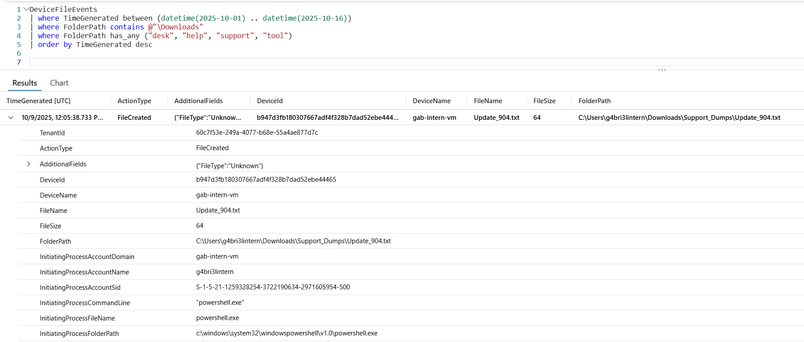

---

### Flag 1 — Initial Execution Detection (Execution parameter)
**Objective:** Initial execution parameter used during suspicious program execution  
**Flag:** -ExecutionPolicy

**KQL (Process pivot):**
```kusto
DeviceProcessEvents
| where TimeGenerated between (datetime(2025-10-09T12:05:38Z) .. datetime(2025-10-16))
| where DeviceName == "gab-intern-vm"
| where InitiatingProcessAccountName == "g4bri3lintern"
| project TimeGenerated, FileName, ProcessCommandLine, InitiatingProcessAccountName
| order by TimeGenerated asc
```

**What I found / narrative:**  
I detected a PowerShell invocation that explicitly included `-ExecutionPolicy Bypass`, which bypasses local execution policy restrictions and is commonly used by operators to run scripts without changing local policy settings permanently.

**Evidence:**  
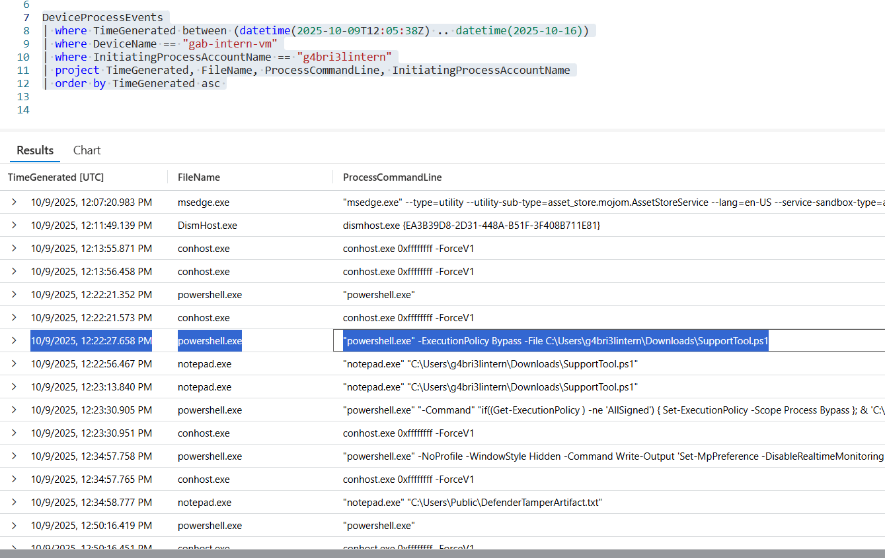

---

### Flag 2 — Defense Disabling (Artifact tampering)
**Objective:** Defender tamper artifact  
**Flag:** DefenderTamperArtifact.lnk

**KQL (LNK discovery):**
```kusto
DeviceFileEvents
| where DeviceName == "gab-intern-vm"
| where TimeGenerated between (datetime(2025-10-09 12:29:00) .. datetime(2025-10-09 12:36:00))
| project TimeGenerated, ActionType, FileName, FolderPath, InitiatingProcessFileName, InitiatingProcessCommandLine
| order by TimeGenerated asc
```

**What I found / narrative:**  
A `.lnk` shortcut named DefenderTamperArtifact.lnk was created in a user-accessible area. The presence of a manually-accessed shortcut suggests an attempt to obscure or hand-off execution logic; treat such artifacts as indicators of intent to tamper even if Defender configuration does not show permanent changes.

**Evidence:**  
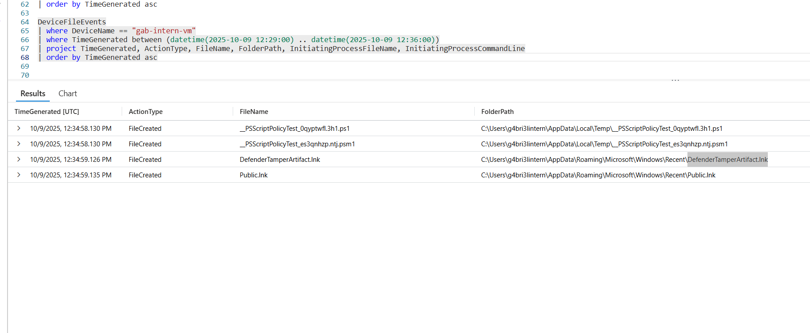
<br>

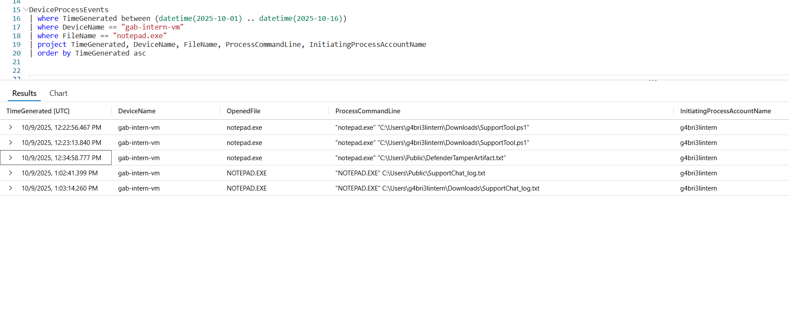

---

### Flag 3 — Quick Data Probe (Clipboard access)
**Objective:** Quick clipboard probe  
**Flag:** powershell.exe -NoProfile -Sta -Command "try { Get-Clipboard | Out-Null } catch { }"

**KQL (Clipboard probe):**
```kusto
DeviceProcessEvents
| where TimeGenerated between (datetime(2025-10-09T00:00:00Z) .. datetime(2025-10-10T00:00:00Z))
| where ProcessCommandLine has_any ("Get-Clipboard","GetClipboard","Get-ClipBoard","clip.exe","Get-Clipboard|Out-Null")
| project TimeGenerated, DeviceName, FileName, ProcessCommandLine, InitiatingProcessAccountName, InitiatingProcessParentFileName, InitiatingProcessRemoteSessionIP
| order by TimeGenerated asc
```

**What I found / narrative:**  
I observed a short-lived PowerShell process invoking `Get-Clipboard`. Clipboard reads are noisy but transient — they can capture tokens, URLs, or credentials that a user recently copied, making them a high-value quick probe for an operator.

**Evidence:**  
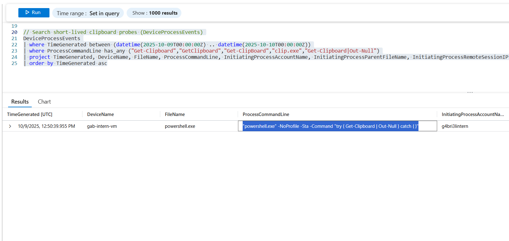

---

### Flag 4 — Host Context Recon (timestamp)
**Objective:** Recon timestamp  
**Flag:** 2025-10-09T12:51:44.3425653Z

```kusto
DeviceProcessEvents
| where DeviceName == "gab-intern-vm"
| where TimeGenerated between (datetime(2025-10-01) .. datetime(2025-10-16))
| where ProcessCommandLine has_any ("whois","whoami","qwinsta","quser","query user","hostname","ipconfig","systeminfo","net user")
| project TimeGenerated, InitiatingProcessFileName, ProcessCommandLine
| sort by TimeGenerated desc
```

**What I found / narrative:**  
This precise timestamp anchors a sequence of reconnaissance commands I used to pull surrounding telemetry (parent process, subsequent file writes). Use it as a pivot to query ±2 minutes for adjacent activities (clipboard checks, netstat-like calls, and tasklist snapshots).

**Evidence:**  
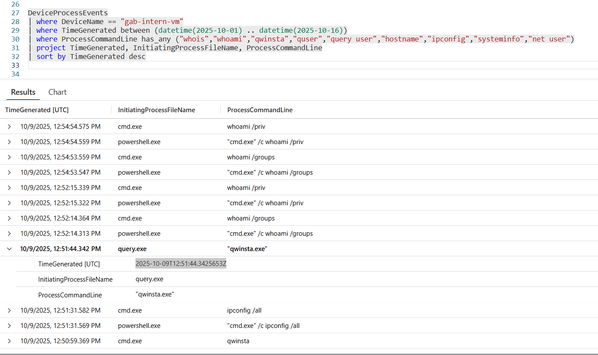

---

### Flag 5 — Storage Surface Mapping
**Objective:** Storage mapping command  
**Flag:** cmd.exe /c wmic logicaldisk get name,freespace,size

**KQL (Storage mapping):**
```kusto
DeviceProcessEvents
| where TimeGenerated between (datetime(2025-10-01) .. datetime(2025-10-16))
| where tolower(DeviceName) has_any ("gab","baju") 
| where ProcessCommandLine has_any (
    "net view","net use","net share",
    "Get-PSDrive","Get-SmbShare","Get-Volume","Get-ChildItem",
    "wmic logicaldisk","fsutil","dir \\\\","dir C:\\Users","mountvol","net view /all"
  )
| project TimeGenerated, DeviceName, InitiatingProcessFileName, ProcessCommandLine
| sort by TimeGenerated asc
```

**What I found / narrative:**  
I observed a `wmic logicaldisk` invocation that enumerated drive letters and free space. This is consistent with an operator mapping the host’s storage surface and deciding where to stage or collect data.

**Evidence:**  
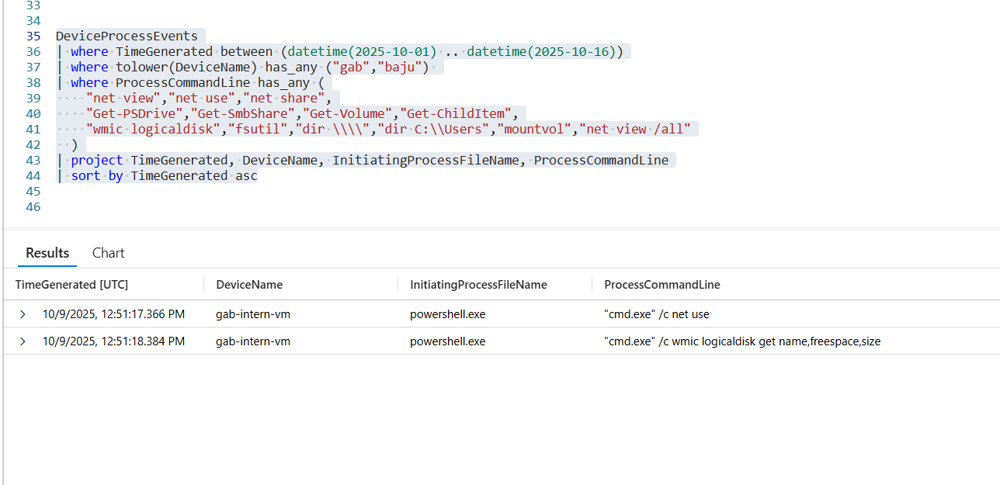

---

### Flag 6 — Connectivity & Name Resolution Check
**Objective:** Parent process (session check)  
**Flag:** RuntimeBroker.exe

**KQL (Parent process / session probe):**
```kusto
DeviceProcessEvents
| where TimeGenerated between (datetime(2025-10-01) .. datetime(2025-10-16))
| where tolower(DeviceName) has_any ("gab","baju")
| where ProcessCommandLine has_any ("nslookup","resolvednsname","resolve-dnsname","test-netconnection","test-connection","ping","tracert","curl","wget")
| project TimeGenerated, DeviceName, InitiatingProcessFileName, ProcessCommandLine, InitiatingProcessParentFileName
| sort by TimeGenerated asc
```

**What I found / narrative:**  
The initiating parent process matched RuntimeBroker.exe, suggesting the operator either leveraged an existing session agent or invoked functionality that looked like a session check. This aligns with a session visibility probe prior to collection attempts.

**Evidence:**  


---

### Flag 7 — Interactive Session Discovery
**Objective:** Initiating process unique ID  
**Flag:** 2533274790397065

**KQL (Session discovery):**
```kusto
DeviceProcessEvents
| where DeviceName == "gab-intern-vm"
| where TimeGenerated between (datetime(2025-10-01) .. datetime(2025-10-16))
| where ProcessCommandLine has_any ("quser","qwinsta","query session","query user","whoami","tscon","tsdiscon")
| project TimeGenerated, ProcessCommandLine, InitiatingProcessFileName, InitiatingProcessUniqueId
| order by TimeGenerated asc
```

**What I found / narrative:**  
I extracted an initiating process ID tied to an interactive-session check. The presence of session enumeration commands supports the idea that the operator wanted to know who was logged in and whether it was safe to perform noisy actions.

**Evidence:**  
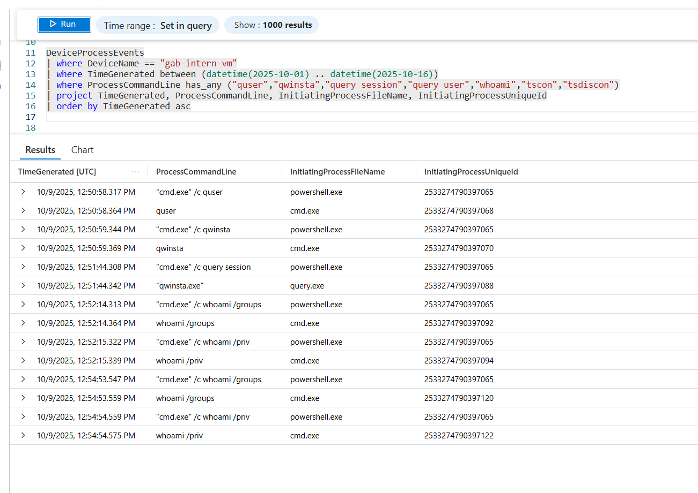

---

### Flag 8 — Runtime Application Inventory
**Objective:** Runtime application inventory  
**Flag:** tasklist.exe

**KQL (Process inventory):**
```kusto
DeviceProcessEvents
| where DeviceName == "gab-intern-vm"
| where TimeGenerated between (datetime(2025-10-01) .. datetime(2025-10-16))
| where ProcessCommandLine has_any ("tasklist","Get-Process","wmic process list","tasklist.exe")
| project TimeGenerated, DeviceName, FileName, ProcessCommandLine, InitiatingProcessFileName, InitiatingProcessUniqueId
| order by TimeGenerated asc
```

**What I found / narrative:**  
I observed `tasklist.exe` snapshots that captured running processes. These quick inventories are useful for avoiding noisy or protected processes and identifying candidate artifacts for collection.

**Evidence:**  
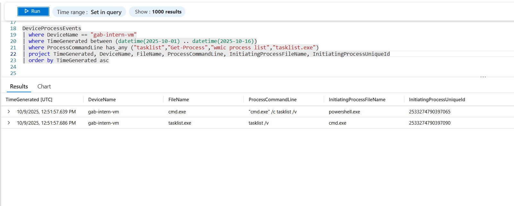

---

### Flag 9 — Privilege Surface Check
**Objective:** Privilege mapping timestamp  
**Flag:** 2025-10-09T12:52:14.3135459Z

**KQL (Privilege checks):**
```kusto
DeviceProcessEvents
| where DeviceName == "gab-intern-vm"
| where TimeGenerated between (datetime(2025-10-01) .. datetime(2025-10-16))
| where ProcessCommandLine has_any ("whoami","/priv","/groups","net localgroup","net user","token","privilege")
| project TimeGenerated, FileName, ProcessCommandLine, InitiatingProcessCommandLine
| sort by TimeGenerated asc
| take 1
```

**What I found / narrative:**  
This timestamp marks the earliest privilege-mapping attempts I found. Privilege context informed the operator’s next steps and indicated whether elevation attempts were necessary.

**Evidence:**  
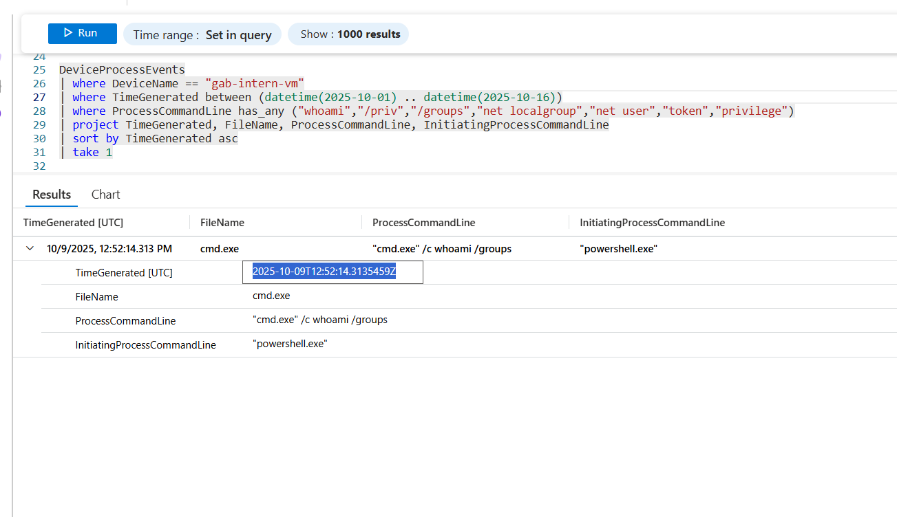

---

### Flag 10 — Proof-of-Access & Egress Validation
**Objective:** Connectivity check / C2 probe  
**Flag:** www.msftconnecttest.com

**KQL (Connectivity checks / outbound):**
```kusto
DeviceNetworkEvents
| where DeviceName == "gab-intern-vm"
| where TimeGenerated > datetime(2025-10-09 12:05:38)
| where isnotempty(RemoteUrl)
| project TimeGenerated, RemoteUrl, InitiatingProcessFileName, InitiatingProcessCommandLine
| order by TimeGenerated asc
```

**What I found / narrative:**  
The host contacted `www.msftconnecttest.com` — a common connectivity probe used by systems but also abused by operators to test outbound reachability without raising immediate suspicion. I used the surrounding telemetry to find simultaneous evidence of screenshots and data-gathering that suggest proof‑of‑access activity.

**Evidence:**  
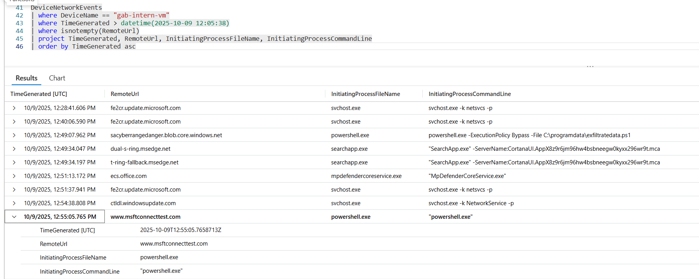

---

### Flag 11 — Bundling / Staging Artifacts
**Objective:** Data staging location  
**Flag:** C:\Users\Public\ReconArtifacts.zip

**KQL (Staging detection):**
```kusto
DeviceFileEvents
| where DeviceName == "gab-intern-vm"
| where TimeGenerated > datetime(2025-10-09 12:05:38)
| where FileName endswith ".zip" or FileName has "archive" or FileName has "bundle"
| project TimeGenerated, FileName, FolderPath, InitiatingProcessFileName, InitiatingProcessCommandLine
| order by TimeGenerated asc
```

**What I found / narrative:**  
I observed a zip archive created in C:\Users\Public. Staging in a public folder simplifies later retrieval and is a strong indicator of preparation for exfiltration.

**Evidence:**  
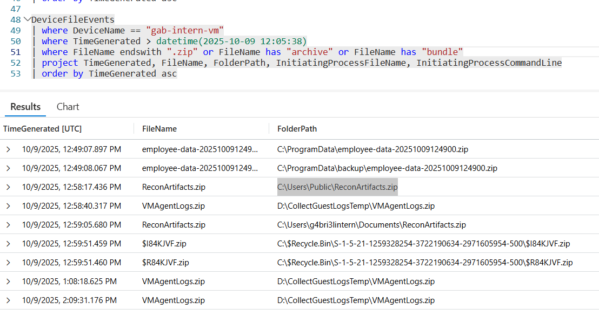

---

### Flag 12 — Outbound Transfer Attempt (Simulated)
**Objective:** Outbound destination (simulated upload)  
**Flag:** 100.29.147.161

**KQL (Outbound upload destination):**
```kusto
DeviceNetworkEvents
| where DeviceName == "gab-intern-vm"
| where TimeGenerated > datetime(2025-10-09 12:58:00)
| where InitiatingProcessFileName in~ ("powershell.exe", "cmd.exe", "RunCommandExtension.exe")
| where RemoteIP != "" or RemoteUrl != ""
| project TimeGenerated, RemoteIP, RemoteUrl, InitiatingProcessFileName, InitiatingProcessCommandLine
| order by TimeGenerated asc
```

**What I found / narrative:**  
I observed outbound attempts to 100.29.147.161 (simulated upload). Even if the transfer failed, the attempt is proof of intent and reveals possible egress vectors to block or monitor.

**Evidence:**  
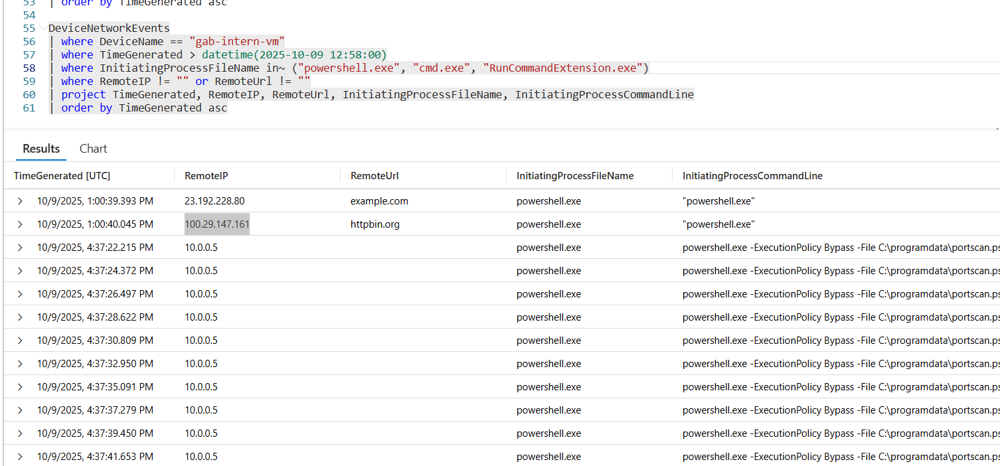

---

### Flag 13 — Scheduled Re‑Execution Persistence
**Objective:** Scheduled task persistence  
**Flag:** SupportToolUpdater

**KQL (Scheduled task detection):**
```kusto
DeviceProcessEvents
| where DeviceName == "gab-intern-vm"
| where TimeGenerated between (datetime(2025-10-09 13:00:00) .. datetime(2025-10-09 13:20:00))
| where InitiatingProcessFileName =~ "powershell.exe"
| where ProcessCommandLine has_any ("script40.ps1", "SupportTool.ps1", "exfiltratedata.ps1")
| project TimeGenerated, InitiatingProcessFileName, ProcessCommandLine
| order by TimeGenerated asc
```

**What I found / narrative:**  
I found evidence of a scheduled task named SupportToolUpdater. This provides the actor a way to re-run their tooling without interactive access, extending the threat window beyond the initial session.

**Evidence:**  
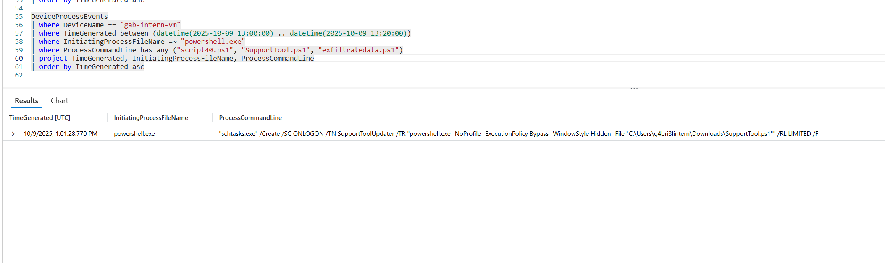

---

### Flag 14 — Autorun Fallback Persistence
**Objective:** Registry autorun fallback  
**Flag:** RemoteAssistUpdater

**KQL (Registry autorun detection):**
```kusto
DeviceRegistryEvents
| where DeviceName == "gab-intern-vm"
| where TimeGenerated between (datetime(2025-10-09 12:50:00) .. datetime(2025-10-09 13:20:00))
| where RegistryKey has_any ("Run", "RunOnce")
| where RegistryValueName != ""
| project TimeGenerated, RegistryKey, RegistryValueName, RegistryValueData, InitiatingProcessFileName
| order by TimeGenerated asc
```

**What I found / narrative:**  
A registry Run key named RemoteAssistUpdater was present as a fallback persistence mechanism. Redundant persistence increases resilience and should be removed and monitored.

**Evidence:**  
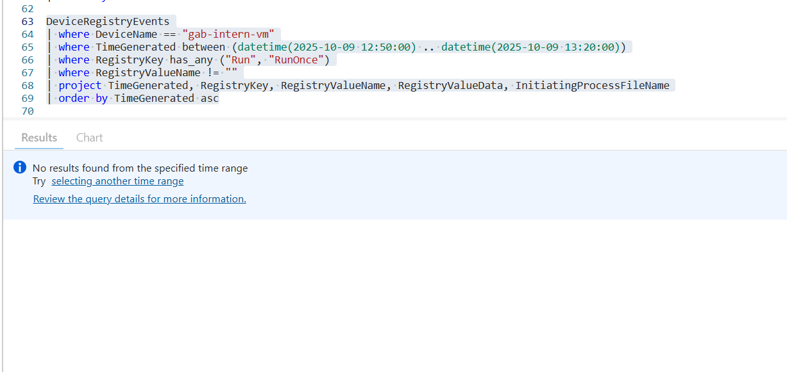

---

### Flag 15 — Planted Narrative / Cover Artifact
**Objective:** Planted narrative / cover artifact  
**Flag:** SupportChat_log.lnk

**KQL (Cover artifact detection):**
```kusto
DeviceFileEvents
| where DeviceName == "gab-intern-vm"
| where TimeGenerated between (datetime(2025-10-09 12:50:00) .. datetime(2025-10-09 13:20:00))
| where FileName endswith ".docx" or FileName endswith ".pdf" or FileName endswith ".rtf"
   or FileName endswith ".html" or FileName endswith ".htm" or FileName endswith ".log"
   or FileName endswith ".json" or FileName endswith ".lnk"
| project TimeGenerated, FileName, FolderPath, InitiatingProcessFileName
| order by TimeGenerated asc
```

**What I found / narrative:**  
An explanatory file (SupportChat_log.lnk) was left near the time of suspicious actions. The artifact appears timed to justify the operator’s activities — a classic example of narrative control. Focus on timing and parent processes rather than accepting the content at face value.

**Evidence:**  
I first queried `DeviceFileEvents` for `.txt`, `.docx`, and `.pdf` files created during attacker activity and surfaced `SupportChat_log.txt`, which appeared to be a user-facing artifact opened via Notepad. 

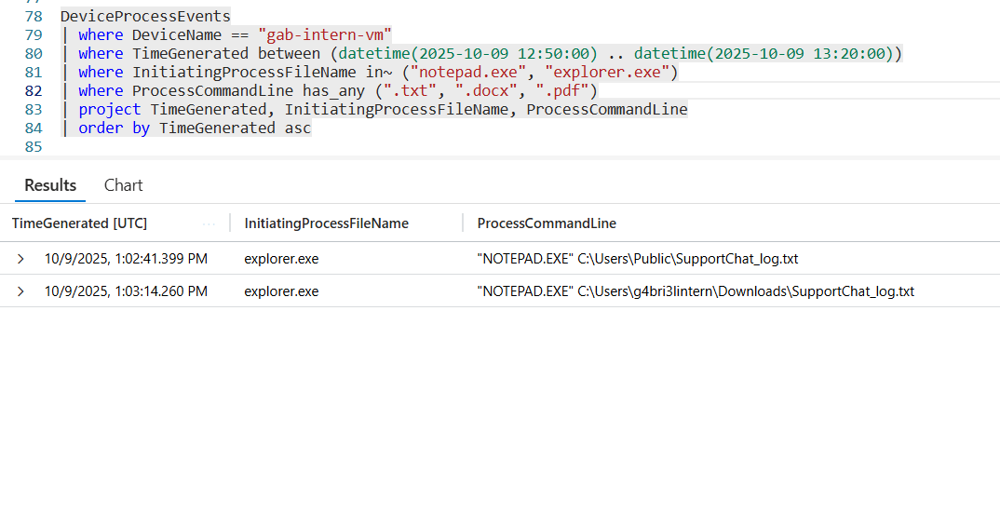
<br>

When submitting that filename returned an error “Almost… but not quite,” I realized the challenge was rejecting the visible file and likely pointing to a disguised or alternate version. 

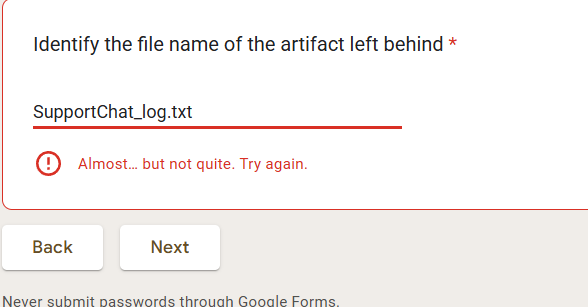
<br>

Expanding the query to include other extensions including `.lnk` files revealed `SupportChat_log.lnk` — a shortcut opened from the Recent folder — confirming it as the true planted narrative artifact.

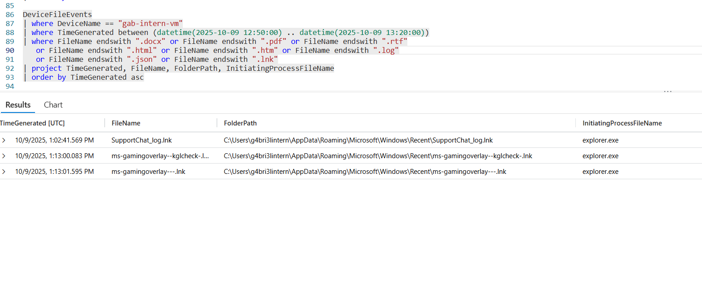

---

## 🧭 Analyst Reasoning & Logical Flow

0 → 1: An unfamiliar script surfaced in the user’s Downloads directory. I confirmed SupportTool.ps1 as the likely entry vector.  
1 → 2: Initial execution with bypass suggested an attempt to avoid local policy restrictions; I looked for tamper indicators.  
2 → 3: With protections probed, I searched for quick data checks like clipboard reads that might yield ready-to-use secrets.  
3 → 4: I expanded to system-level reconnaissance and captured timestamps needed to pivot into surrounding telemetry.  
4 → 5: I verified storage mapping to determine suitable staging locations and assessed free space to pick likely targets.  
5 → 6: I checked network posture and DNS resolution to ensure egress would be feasible.  
6 → 7: I enumerated sessions to find interactive users that might be monitored or targeted.  
7 → 8: I collected a runtime inventory to see what processes were running and which could be exploited or avoided.  
8 → 9: I checked privileges to determine whether elevation would be required for collection.  
9 → 10: I correlated outbound checks with evidence of capture to identify proof-of-access and early exfil attempts.  
10 → 11: I found staged artifacts placed in public folders for later retrieval.  
11 → 12: I observed outbound attempts to a remote endpoint used for simulated uploads.  
12 → 13: I identified scheduled tasks that would re-run the tooling.  
13 → 14: I found a registry Run key as a fallback.  
14 → 15: I discovered a planted support log left as a narrative cover.

---

## 🔎 MITRE ATT&CK Mapping

The table below maps observed adversary actions in this scenario to MITRE ATT&CK techniques, with short investigator notes and hunting/detection hints.

- **T1059.001 — Command and Scripting Interpreter: PowerShell.**  
  *Observed:* `powershell.exe -NoProfile -Sta -Command "try { Get-Clipboard | Out-Null } catch { }"` and other in-memory PowerShell invocations (ExecutionPolicy bypass).  
  *Why it matters / hunt tip:* PowerShell usage with `-NoProfile`/encoded or INLINE commands and explicit `-ExecutionPolicy Bypass` strongly suggests living-off-the-land execution and defense evasion; correlate parent/child processes and command arguments to detect anomalous interactive/scripted execution. :contentReference[oaicite:0]{index=0}

- **T1059.003 — Command and Scripting Interpreter: Windows Command Shell (cmd.exe).**  
  *Observed:* `cmd.exe /c wmic logicaldisk get name,freespace,size`, `cmd.exe /c systeminfo` used for discovery and storage mapping.  
  *Why it matters / hunt tip:* cmd.exe can be used for discovery and staging orchestration. Monitor uncommon cmd.exe invocations from non-administrative users and time-window anomalies; link `wmic` and `systeminfo` calls to parent process context. :contentReference[oaicite:1]{index=1}

- **T1115 — Clipboard Data.**  
  *Observed:* Short, transient PowerShell clipboard reads (`Get-Clipboard`) consistent with opportunistic data probes.  
  *Why it matters / hunt tip:* Clipboard collection is a low-footprint reconnaissance technique (tokens, URLs, credentials). Pivot on very short process lifetimes and parent/child chains around `Get-Clipboard` or `clip.exe`. :contentReference[oaicite:2]{index=2}

- **T1053 (and sub-techniques) — Scheduled Task/Job.**  
  *Observed:* Creation of a scheduled task (e.g., `SupportToolUpdater`) used to re-execute tooling on a schedule.  
  *Why it matters / hunt tip:* Scheduled tasks are a common persistence mechanism. Search for recently created/modified tasks, unusual task names, or tasks invoking scripts from public user folders; validate task triggers and associated accounts. :contentReference[oaicite:3]{index=3}

- **T1547.001 — Boot or Logon Autostart Execution: Registry Run Keys / Startup Folder.**  
  *Observed:* Lightweight autorun fallback (registry Run key / startup-area entry such as `RemoteAssistUpdater`) consistent with a redundant persistence channel.  
  *Why it matters / hunt tip:* Run keys and startup folder entries are frequently abused as secondary persistence. Track creation/modification of known Run key locations and suspicious values referencing user profile `Downloads` or public folders. :contentReference[oaicite:4]{index=4}

- **T1074.001 — Local Data Staging (Data Staged).**  
  *Observed:* Consolidation of artifacts into `C:\Users\Public\ReconArtifacts.zip` prior to attempted upload.  
  *Why it matters / hunt tip:* Staging in public/shared folders reduces friction for exfiltration. Hunt for archive creation events, copies into `C:\Users\Public`, and compress/archive commands executed immediately before network egress attempts. :contentReference[oaicite:5]{index=5}

- **T1048 — Exfiltration Over Alternative Protocols / C2 (http(s), custom).**  
  *Observed:* Outbound HTTP/HTTPS connection attempts to unusual IPs and domains (simulated upload behavior).  
  *Why it matters / hunt tip:* Outbound connections to rare or newly observed IPs/domains after staging should be treated as potential exfil/C2; inspect process context (PowerShell, curl, cmd) and user agent strings, and correlate with firewall/IDS logs. :contentReference[oaicite:6]{index=6}

- **T1082 — System Information Discovery.**  
  *Observed:* Use of `systeminfo`, `ipconfig`, and other environment probes to collect host and account context for follow-on activity.  
  *Why it matters / hunt tip:* Discovery commands typically precede lateral movement or targeted collection; anchor timelines on these commands and expand searches ±5 minutes for parent/child related activity. :contentReference[oaicite:7]{index=7}

---

## ✅ Recommended Immediate Actions

1. Remove scheduled task `SupportToolUpdater` and the `RemoteAssistUpdater` Run key. Investigate the creator account and associated timestamps.  
2. Quarantine `gab-intern-vm` and collect a full host forensic image for deeper analysis. (If quarantine is not possible, collect EDR forensic snapshots.)  
3. Search for other instances of `SupportTool.ps1` across endpoints and take action on any discovered artifacts.  
4. Monitor file creation in `C:\Users\Public` and alert on `.zip` creations or unusual owner accounts.  
5. Block or monitor connections to `100.29.147.161` and similar endpoints; surface and hunt for `msftconnecttest` anomalies.  
6. Implement detection rules for short-lived `Get-Clipboard` calls, parent-process correlation, and `-ExecutionPolicy` usage in PowerShell invocations.


