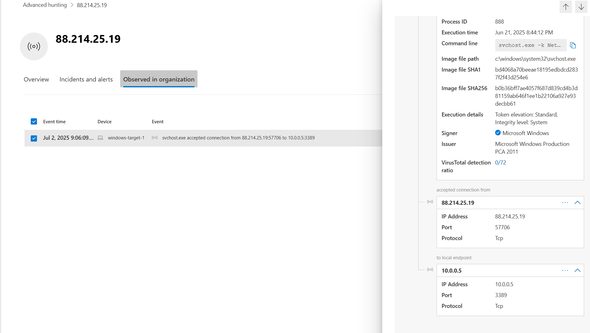
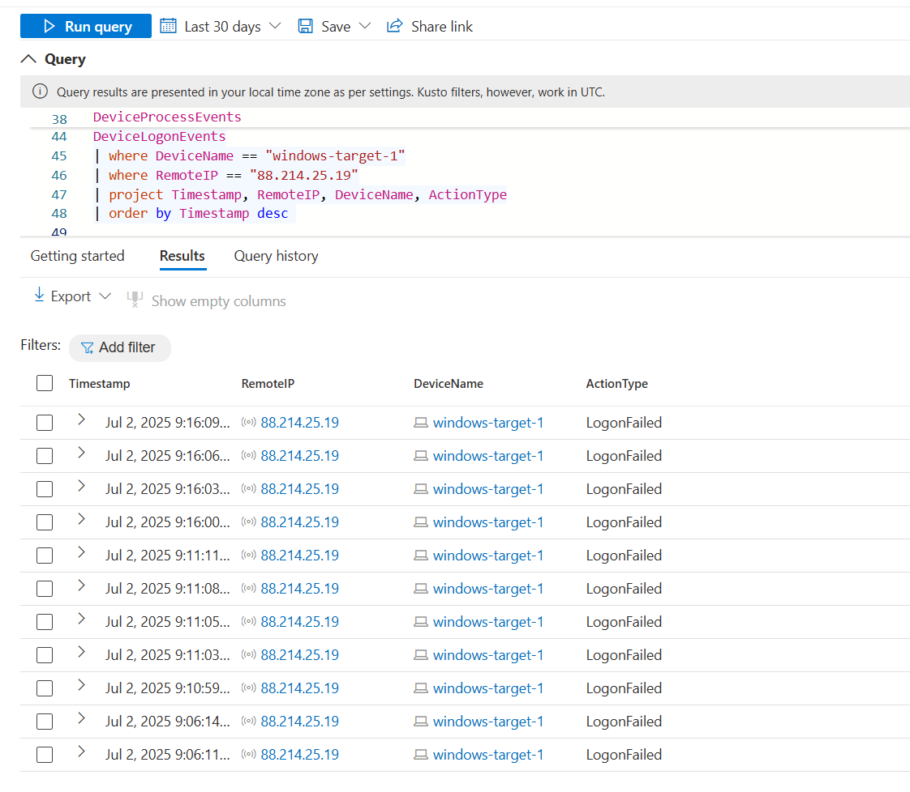

# 🔍 The Invisible RDP: Suspected RDP Compromise

**Analyst:** Peter Van Rossum  
**Date Range Investigated:** July 2–3, 2025  
**Target Device:** `windows-target-1`  
**Internal IP:** `10.0.0.5`  
**External IP Involved:** `88.214.25.19`  

---

## ⚠️ Limitations & Considerations

This investigation occurred in a CyberRange lab. While activity like external RDP access and suspicious `svchost.exe` usage mirrors real-world compromise, consider:

- The system may have been **intentionally exposed**
- Behaviors may stem from **red team simulation**
- **Telemetry gaps** may result from lab settings

Still, the timing and persistence suggest possible malicious behavior. This report reflects findings within that context.

---

## 🎯 Objective

The hunt began after repeated failed logins to `windows-target-1`, followed by a successful RDP connection from external IP `88.214.25.19`.

Goals:

- Confirm external RDP access to the internal host  
- Identify signs of post-compromise or persistence  
- Assess how this activity evaded standard Defender telemetry

---

## 🧭 Investigation Timeline and Findings

### ✅ 1. Discovery of Suspicious Inbound RDP Connection

While reviewing Defender portal data, I manually pivoted into the **"Observed in organization"** tab for IP address `88.214.25.19`. There, I found the following:

> `windows-target-1 svchost.exe accepted RDP connection from 88.214.25.19:57706 to 10.0.0.5:3389`



- Port `3389` is used for **Remote Desktop Protocol (RDP)**  
- The connection was **inbound from the public internet**, suggesting **exposed RDP**  
- `svchost.exe` handled the connection — which is atypical, as RDP is normally managed by `TermService`

**Why this is concerning:**  
The use of `svchost.exe` to accept an external RDP session raises red flags for **process masquerading, injection, or lateral movement**, especially in the absence of a standard logon event.

---

### 🔍 2. Attempts to Corroborate the Event in KQL

Although the portal showed a successful RDP connection, it could not be located via KQL:

```kql
DeviceNetworkEvents
| where DeviceName == "windows-target-1"
| where RemoteIP == "88.214.25.19"
| where RemotePort == 3389 or LocalPort == 3389
```

This supports the hypothesis that this was a **cloud-side correlation event**, likely generated by Defender’s **SmartSignals** or backend threat intelligence — not standard endpoint telemetry.

---

### 🔐 3. Sequence of Failed RDP Logon Attempts

I queried `DeviceLogonEvents` to examine prior login behavior from the same IP:

```kql
DeviceLogonEvents
| where DeviceName == "windows-target-1"
| where RemoteIP == "88.214.25.19"
| where ActionType == "LogonFailed"
| project Timestamp, RemoteIP, DeviceName, ActionType
| order by Timestamp desc
```

The results revealed a **burst of failed login attempts** on **July 2, 2025**, between **09:06 and 09:16 UTC**, all from `88.214.25.19`.



> This pattern strongly suggests **brute-force activity**, immediately preceding the successful connection. Combined with the use of `svchost.exe`, this increases the likelihood of a **credential compromise or unauthorized session reuse**.

---

### 🕳️ 4. Absence of Successful Logon Events

To validate the session further, I searched for any recorded **successful logons** from that IP:

```kql
DeviceLogonEvents
| where DeviceName == "windows-target-1"
| where RemoteIP == "88.214.25.19"
| where ActionType == "LogonSuccess"
```

This returned **no results** — an anomaly for a legitimate RDP session.

> This absence supports the theory that the attacker gained access via **non-interactive methods**, such as **token theft** or **process injection**, allowing remote control without generating a traditional login event.

---

### 🧪 5. Process Connected to Attacker IP

To conclude the investigation, I searched for any process on `windows-target-1` that directly communicated with `88.214.25.19`:

```kql
DeviceNetworkEvents
| where DeviceName == "windows-target-1"
| where RemoteIP == "88.214.25.19"
| where Timestamp between (datetime(2025-07-02T00:00:00Z) .. datetime(2025-07-03T23:59:59Z))
| project Timestamp, InitiatingProcessCommandLine, RemotePort, LocalPort
| order by Timestamp asc
```

This revealed a single connection:

| Timestamp              | Process                | Command Line                          | Remote Port | Local Port |
|------------------------|------------------------|----------------------------------------|-------------|------------|
| July 2, 2025 09:06:09 UTC | svchost.exe           | `svchost.exe -k NetworkService`        | 57706       | 3389       |

> This confirms that `svchost.exe` — not a standard RDP handler — was the receiving process for a successful RDP session with the attacker IP. The timing aligned precisely with the earlier brute-force attempts, reinforcing the hypothesis of post-compromise access.

---

## 🧠 6. Why This Is a High-Fidelity Threat Signal

Several factors converge to make this a strong indicator of compromise:

- **Successful inbound RDP** from a suspicious external IP  
- **No corresponding login success** recorded in telemetry  
- **Unusual process (`svchost.exe`)** handled the RDP session  
- The event was only surfaced through **backend SmartSignal correlation** — suggesting **evasion-aware techniques**  
- The connection occurred **immediately following a brute-force attempt**

Together, these indicators point to **living-off-the-land (LotL) tactics** and **stealthy post-compromise persistence** using native system processes and credential abuse.

---

## 📌 Conclusion

This investigation uncovered strong signals of a likely RDP-based compromise involving:

- External session initiation from a known brute-force IP  
- Anomalous use of `svchost.exe` to handle RDP  
- Absence of standard authentication or telemetry trails

These findings suggest the host was under unauthorized control using stealthy, native techniques that bypass traditional detections.

---

## 🧩 Recommendations (for real-world incidents)

If this were a production system, the following steps would be recommended:

- **Immediately isolate `windows-target-1` from the network**  
- **Capture memory and create full disk images** for forensic review  
- **Audit autoruns, services, WMI persistence, and scheduled tasks**  
- **Reset all credentials associated with the device**  
- **Harden or disable RDP** via firewall/NSG rules and enforce MFA where RDP is required  

---

_Report generated by Peter Van Rossum, July 3, 2025_
