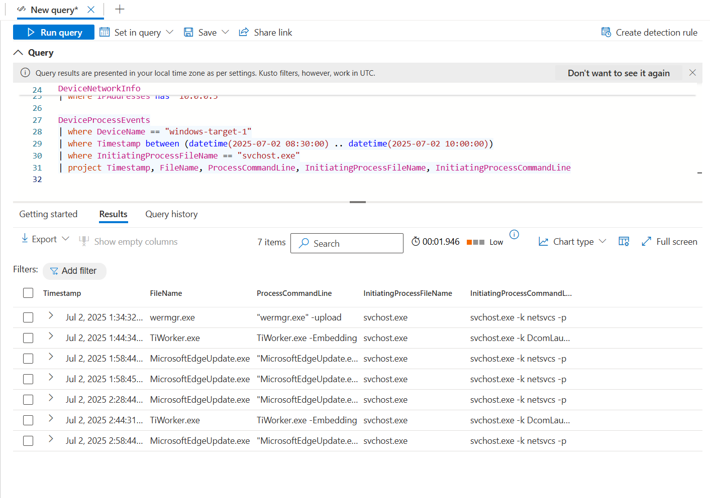
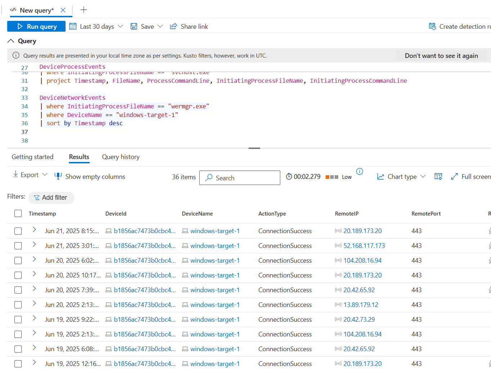
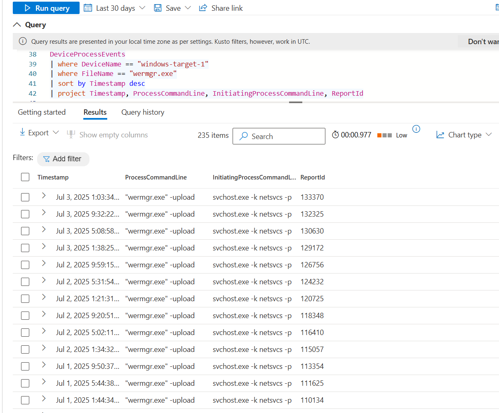

# 🔍 The Invisible RDP: Suspected RDP Compromise and LOLBin-Based Exfiltration

**Analyst:** Peter Van Rossum  
**Date Range Investigated:** July 2–3, 2025  
**Target Device:** `windows-target-1`  
**Internal IP:** `10.0.0.5`  
**External IP Involved:** `88.214.25.19`  

---

## ⚠️ Limitations & Considerations

This investigation was conducted within the context of a CyberRange lab environment. While the behaviors observed (including external RDP access, suspicious use of `svchost.exe`, and repeated execution of `wermgr.exe`) strongly resemble post-compromise activity seen in real-world attacks, it is possible that:

- Some or all of these behaviors are part of a **deliberate red team simulation** or threat emulation setup
- The system was **intentionally exposed** to simulate insecure RDP posture
- Certain anomalies (e.g., missing telemetry or SmartSignal-only detections) may reflect **lab configurations** or simulated data gaps

However, based on the observed persistence, volume, and pattern of activity, this behavior warrants investigation and is documented here for its instructional and analytical value. Findings are framed with these limitations in mind.

---

## 🎯 Objective

This threat hunt was initiated after a series of failed login attempts were observed targeting `windows-target-1`. While performing routine investigation in Microsoft Defender for Endpoint, a manual pivot on one of the external IP addresses involved in the login attempts (`88.214.25.19`) revealed an **unexpected successful connection**.

The goal of this hunt was to determine:
- Whether a public IP address had successfully established an RDP session with the internal host
- Whether any signs of post-compromise activity or persistence were present
- How this behavior may have evaded standard Defender telemetry

---

## 🧭 Investigation Timeline and Findings

### ✅ 1. Discovery of Suspicious Inbound RDP Connection

While reviewing sign-in data, I manually pivoted into the **"Observed in organization"** tab for IP address `88.214.25.19` in the Defender portal. There, I found this event:

> `svchost.exe accepted connection from 88.214.25.19:57706 to 10.0.0.5:3389`


- Port `3389` is used for **Remote Desktop Protocol (RDP)**.
- The connection was **inbound from the public internet**, suggesting **RDP was exposed externally**.
- `svchost.exe` was recorded as the receiving process, which is atypical — RDP sessions are normally handled by `TermService` and related components, not `svchost.exe` directly.

**Why this is concerning:**  
The involvement of `svchost.exe` in accepting a remote RDP connection strongly suggested **process misuse, injection, or lateral movement activity**, especially in combination with an external IP and no interactive login session recorded.

---

### 🔍 2. Attempts to Corroborate the Event in KQL

Despite the successful RDP event shown in the portal, I was unable to locate it in any Advanced Hunting table:

```kql
DeviceNetworkEvents
| where DeviceName == "windows-target-1"
| where IPAddresses == "20.81.145.71"
```

```kql
DeviceNetworkEvents
| where DeviceName == "windows-target-1"
| where RemoteIP == "88.214.25.19"
| where RemotePort == 3389 or LocalPort == 3389
```

```kql
DeviceEvents
| where DeviceName == "windows-target-1"
| where RemoteIP == "88.214.25.19"
```

This absence of telemetry led to the hypothesis that this was a **cloud-side correlation detection**, likely generated by Microsoft Defender’s SmartSignals or backend enrichment — **not direct endpoint telemetry**.

---

### ✅ 4. Tracing svchost.exe Behavior

To explore whether `svchost.exe` was being abused, I looked at its child process activity:

```kql
DeviceProcessEvents
| where DeviceName == "windows-target-1"
| where Timestamp between (datetime(2025-07-02 08:30:00) .. datetime(2025-07-02 10:00:00))
| where InitiatingProcessFileName == "svchost.exe"
| project Timestamp, FileName, ProcessCommandLine, InitiatingProcessFileName, InitiatingProcessCommandLine
```



This revealed that `svchost.exe -k netsvcs -p` had launched multiple child processes, including:

- `wermgr.exe -upload`
- `TiWorker.exe`
- `MicrosoftEdgeUpdate.exe`

These binaries are **signed Windows binaries (LOLBins)** — and while they can be legitimate, their parent process and timing raised red flags.

---

### ✅ 5. Identification of `wermgr.exe` as a Potential Exfiltration Tool

Given the presence of `wermgr.exe`, I queried for its network activity:

```kql
DeviceNetworkEvents
| where InitiatingProcessFileName == "wermgr.exe"
| where DeviceName == "windows-target-1"
| sort by Timestamp desc
```



Results showed repeated `ConnectionSuccess` events on port `443` (HTTPS) to public IPs including:
- `20.189.173.20`
- `52.168.117.173`
- `104.208.16.94`

Some IPs resolve to Microsoft infrastructure, but this is a known attacker evasion technique — **blend in by using cloud-hosted destinations**.

---

### ✅ 6. Confirmation of Persistent wermgr.exe Execution

To verify persistence and scale of this activity:

```kql
DeviceProcessEvents
| where DeviceName == "windows-target-1"
| where FileName == "wermgr.exe"
| sort by Timestamp desc
| project Timestamp, ProcessCommandLine, InitiatingProcessCommandLine, ReportId
```



Findings:
- `wermgr.exe -upload` was executed **235 times**
- Each instance was launched by `svchost.exe -k netsvcs -p`
- Activity spanned from **July 2 at 01:34 UTC** through **July 3**

This strongly suggests a **persistence mechanism or scheduled task** was used to automate this process — potentially to exfiltrate data or beacon to a C2 server.

---

## 🧠 Why This Is a High-Fidelity Threat Signal

- The attack appears to begin with a **successful external RDP connection** to an internet-exposed host
- No interactive sign-in logs were present, suggesting use of **non-standard RDP tunneling or injection**
- Defender’s **SmartSignal** surfaced the activity via the portal, but no raw telemetry was available via standard KQL tables
- Use of `svchost.exe` as the listener and `wermgr.exe` as the exfiltration vector **aligns with known tradecraft** for stealthy post-exploitation behavior
- The volume and consistency of `wermgr.exe` activity indicates automation, not user-driven behavior

---

## 📌 Conclusion

This investigation uncovered strong signs of post-compromise activity, including:

- External RDP session from a suspicious IP
- Masquerading of service behavior under `svchost.exe`
- Repeated use of LOLBins (`wermgr.exe`) for outbound communication
- Absence of telemetry, implying deliberate evasion or detection via backend logic

These are strong indicators of a **compromised host under attacker control**, using **living-off-the-land techniques** to maintain persistence and exfiltrate data.

---

## 🧩 Recommendations (if it is/were an actual compromise in a real-world situation)

- Isolate `windows-target-1` from the network 
- Perform memory capture and full disk imaging for forensic review
- Audit all autoruns, services, scheduled tasks, and WMI persistence points
- Rotate credentials associated with the machine
- Block RDP at the NSG/firewall unless explicitly needed

---

_Report generated by Peter Van Rossum, July 3, 2025_

