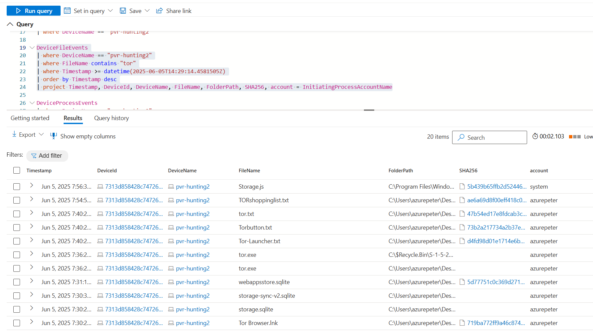

# 🧪 Unauthorized TOR Activity Detection

Detects unsanctioned TOR browser installation and usage by correlating endpoint telemetry, process execution, and outbound network traffic. This lab demonstrates how security analysts can use Microsoft Defender for Endpoint (MDE) data and Sentinel analytics to investigate anonymization tools that may be used to evade monitoring and exfiltrate data.

<div align="center">
  
</div>


---

## 🛠️ Scenario

Management raised concerns that a user may be leveraging the TOR browser to bypass corporate network controls. This suspicion arose from unusual encrypted traffic patterns observed in the firewall logs, including connections to known TOR entry nodes. Additionally, anonymous tips were received alleging that the employee had been discussing ways to access blocked websites during work hours.

To assess the situation, a targeted threat hunt was conducted using Microsoft Defender for Endpoint and Sentinel to investigate potential TOR browser installation, execution, and network usage. The objective was to confirm or dismiss the suspicion and determine whether further escalation or response was required.

---

## 🔍 Investigation Strategy

The hunt was guided by the following high-level approach to identify Indicators of Compromise (IoCs) associated with TOR usage:

1. **Search `DeviceFileEvents`** for evidence of TOR browser downloads or related executable files (e.g., `tor.exe`, `firefox.exe`)
2. **Analyze `DeviceProcessEvents`** for signs of TOR browser installation or execution
3. **Inspect `DeviceNetworkEvents`** for connections to ports commonly used by TOR (9001, 9050, etc.), including known relay nodes

---

## 📁 Step-by-Step Analysis

### 🔎 Step 1: File Download and Creation Artifacts

Using the `DeviceFileEvents` table, we filtered for file names containing the string `"tor"` on the device `pvr-hunting2`. This search returned evidence that the user `azurepeter` had downloaded the TOR installer executable:  
`tor-browser-windows-x86_64-portable-14.5.3.exe`.

Additionally, two user-generated text files were found: `shoppinglist.txt`, which was later renamed to `TORshopping.txt`. This behavior may suggest either note-taking related to the installation or an attempt to obfuscate the file’s intent.

```kusto
DeviceFileEvents
| where DeviceName == "pvr-hunting2"
| where FileName contains "tor"
| where Timestamp >= datetime(2025-06-05T14:29:14.4581505Z)
| order by Timestamp desc
| project Timestamp, DeviceId, DeviceName, FileName, FolderPath, SHA256, account = InitiatingProcessAccountName
```



---

### 🛠️ Step 2: Silent Installation via Command Line

We pivoted to the `DeviceProcessEvents` table to investigate how the TOR installer was executed. The logs showed that the installer was launched with the `/S` flag—commonly used for silent installation. This suggests an intentional attempt to install the application without displaying a GUI or triggering prompts.

```kusto
DeviceProcessEvents
| where DeviceName == "pvr-hunting2"
| where ProcessCommandLine contains "tor-browser-windows-x86_64-portable-14.5.3.exe"
| project Timestamp, DeviceName, AccountName, FileName, FolderPath, ProcessCommandLine, SHA256 
```


---

### 🚀 Step 3: TOR Browser Execution Detected

A follow-up query to `DeviceProcessEvents` revealed that both `tor.exe` and `firefox.exe` were launched on the system, confirming that the TOR browser had not only been installed, but also executed. This occurred just minutes after the installation timestamp, supporting the hypothesis that the user proceeded directly into using the anonymizing browser.

```kusto
DeviceProcessEvents
| where DeviceName == "pvr-hunting2"
| where FileName has_any ("tor.exe", "firefox.exe", "tor-browser.exe")
| project Timestamp, DeviceName, AccountName, FileName, FolderPath, ProcessCommandLine, SHA256 
| order by Timestamp desc 
```


---

### 🌐 Step 4: TOR Network Access Confirmed via Port 9001

To verify actual usage of the TOR network, we examined `DeviceNetworkEvents`. A network session initiated by `tor.exe` was successfully established to external IP address `68.8.241.30` over port `9001`, which is a well-known entry node port for the TOR network. Additional outbound connections occurred over ports 443 and 80, consistent with TOR traffic patterns.

```kusto
DeviceNetworkEvents
| where DeviceName == "pvr-hunting2"
| where InitiatingProcessAccountName != "system"
| where InitiatingProcessFileName in ("tor.exe", "firefox.exe", "tor-browser")
| where RemotePort in ("9001", "9030", "9040", "9050", "9051", "9150", "80", "443")
| project Timestamp, DeviceName, ActionType, InitiatingProcessAccountName, RemoteIP, RemotePort, RemoteUrl, InitiatingProcessFileName, InitiatingProcessFolderPath
```


---

### 📄 Step 5: Suspicious File Renamed on Desktop

The final file event of interest involved the renaming of a Desktop file from `shoppinglist.txt` to `TORshopping.txt`. Although the contents were not inspected during this hunt, the context and naming strongly imply the file may be related to the user’s use of TOR and may warrant further review.


---

## 🧭 Timeline of Events

- **7:29:14 AM** — *TOR browser installer downloaded*  
  **Filepath:** `C:\Users\azurepeter\Downloads\tor-browser-windows-x86_64-portable-14.5.3.exe`

- **7:29:28 AM** — *Installer accessed again*  
  Possibly opened or staged for execution.

- **7:29:29 AM** — *Silent install triggered*  
  TOR installed using `tor-browser-windows-x86_64-portable-14.5.3.exe /S`

- **7:30:08 AM** — *`tor.txt` file created*  
  Indicates post-installation activity.

- **7:30:26 AM** — *TOR browser executed*  
  Processes `tor.exe` and `firefox.exe` launched.

- **7:30:45 AM** — *Network connection to TOR relay established*  
  Outbound connection to `68.8.241.30` on port `9001`.

- **7:40:14 AM** — *Reconfirmation of silent install activity*  
  Duplicate execution of installer recorded.

- **7:54:59 AM** — *File renamed to `TORshopping.txt`*  
  Suggests possible concealment or data staging.

---

## 🔎 Key Findings

- TOR browser was **downloaded, silently installed, and executed** on a corporate-managed system without proper authorization.
- An **outbound TOR network connection was confirmed** using known entry node ports and IP addresses.
- Local artifacts, such as the creation of `tor.txt` and renaming of `shoppinglist.txt`, imply deliberate and potentially covert behavior.
- The SHA-256 hash of the installer file matched official TOR binaries:
  ```
  3b7e78a4ccc935cfe71a0e4d41cc297d48a44e722b4a46f73b5562aed9c1d2ea
  ```

---

## 📝 Summary

This investigation confirms that user **azurepeter** intentionally downloaded, silently installed, and launched the TOR browser on the company workstation **pvr-hunting2**. The activity included establishing outbound TOR network connections, bypassing perimeter monitoring, and renaming local files—possibly to obscure intent. Notably, the user created and later renamed a file to **TORshopping.txt**, which may contain information related to their intended TOR usage or browsing activity. All actions were initiated without proper authorization, circumvented user controls, and may indicate attempts to access restricted or anonymous web services during working hours.

---

## 🚨 Response Actions

- The device `pvr-hunting2` was **isolated from the network** to prevent further unauthorized activity.
- A copy of this report was **submitted to management** for HR and policy review.
- Further investigation into user intent and possible data leakage is ongoing.

---

> 🧠 **Reflection:** This lab highlights the importance of correlating file activity, process execution, and network telemetry during an investigation. While standalone indicators might appear benign, their intersection revealed a clear pattern of misuse.


---
